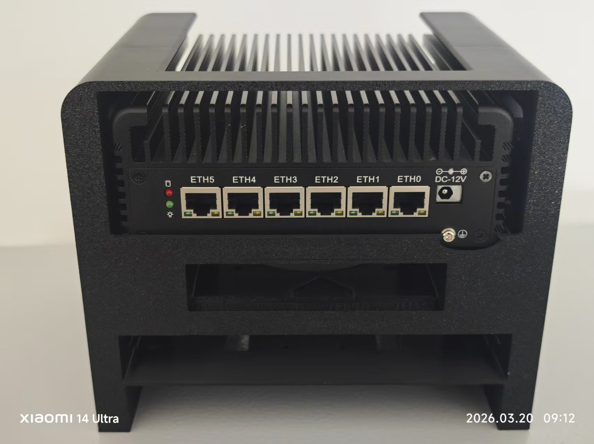
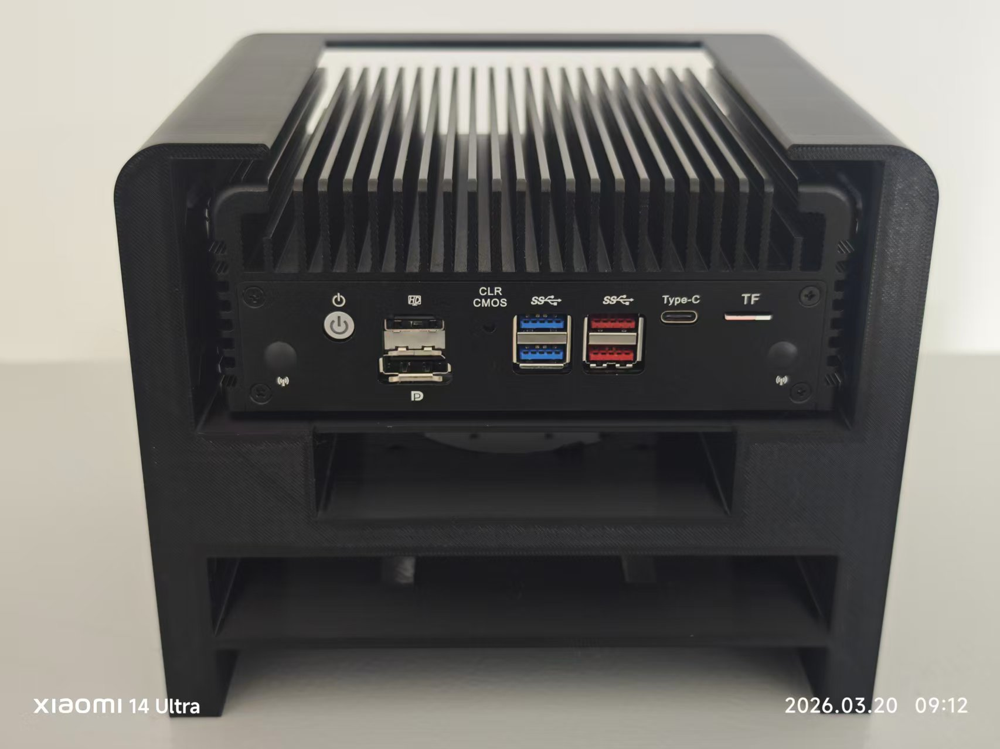

# 软路由的底座

## 书接上文
给我的软路由做了一个支架,主要是因为发热太大了，硬盘轻松突破75℃。在[之前的文章]()中我就想做一个。可是那时候我只有PLA材料，不耐热，只能再去买PETG材料，但是我贪图便宜，买了个10块钱1千克的垃圾公司，好像还是JD自营的，结果不断卡料，折腾几天以后我受不了了，斥资50大洋买了更贵的，果然一分钱一分货。

看看这坎坷的打印过程。注意我还没有全部截图。

>我已经给了差评！🤮

打印出来的我还是很喜欢的。

这里可以看看录像，特别解压。



预留了风扇位和风扇螺丝孔以及2.5硬盘位，能装下四块2.5寸硬盘，(两块用螺丝固定，适合HDD，两块用双面胶，适合SSD)感觉很不错。

---

> 作者: Mavelsate  
> URL: https://blog.yeliya.site/posts/20260320%E8%BD%AF%E8%B7%AF%E7%94%B1%E5%BA%95%E5%BA%A7/  

