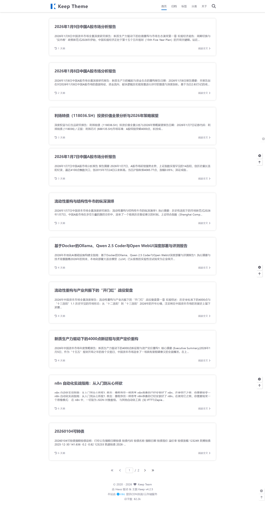

# Hexo切换到Hugo

## 1.更换程序
更换了程序，hexo的确很好用，但是理论上后期它的编译速度会很慢很慢，后来了解了hugo，halo，好家伙全是**H**字辈分的，认真比较了下，选了hugo，整体和hexo差不多。包括部署、发布之类，都是CI发布，git部署,静态托管。
其实更心水halo，不过halo需要VPS，要花钱，看能不能搞个免费的服务器，能搞到我就转到halo。
总体来说，没有踩到什么坑，就是网上教程和AI都没提到fixit搜索怎么打开，还是我翻帮助文档才确定方法的，AI给的方案太折腾了。
因为我很喜欢hexo上的keep theme，所以我在挑选主题和折腾主题上花了一些时间，不过总体还是很克制的。那种CSS限时免费的疯狂美化我做不来，~~当然也没那技术。~~

## 2.方案比较
### 📊 2.1 核心参数速览表

| 维度 | **Hexo** | **Hugo** | **Halo** |
| :--- | :--- | :--- | :--- |
| **核心语言** | Node.js (JavaScript) | Go (Golang) | Java (Spring Boot) |
| **博客类型** | **静态** (SSG) | **静态** (SSG) | **动态** (CMS) |
| **生成速度** | 较慢 (千篇文章需几分钟) | 极快 (千篇文章仅几秒) | 无需生成 (实时渲染) |
| **上手难度** | 中等 (需懂 npm/git) | 中等 (需懂命令行/git) | 简单 (图形化安装) |
| **写作方式** | 本地 Markdown + 命令行 | 本地 Markdown + 命令行 | 在线后台编辑器 / 客户端 |
| **部署成本** | **低/免费** (GitHub/Vercel) | **低/免费** (GitHub/CF Pages) | **高** (需购买 VPS 服务器) |
| **数据存储** | 本地 Markdown 文件 | 本地 Markdown 文件 | 数据库 (H2/MySQL) |
| **插件生态** | ⭐⭐⭐⭐⭐ (极为丰富) | ⭐⭐⭐ (够用但难改) | ⭐⭐⭐⭐ (应用市场) |

---

### 🛠️ 2.2 深度解析

#### 🐢 Hexo：生态之王，入门首选
Hexo 是基于 Node.js 的静态博客框架。它的最大优势在于**生态**。由于前端开发者众多，Hexo 拥有海量的高质量主题（如 Next, Butterfly）和插件。

* **优点：**
    * **生态无敌：** 几乎你想要的任何功能（看板娘、音乐播放器、特效）都有现成的 npm 插件。
    * **社区活跃：** 遇到问题随便一搜就有答案，中文文档完善。
    * **免费部署：** 生成的是纯 HTML，可以托管在 GitHub Pages、Vercel 等免费平台。
* **缺点：**
    * **构建慢：** 当文章数量超过 500 篇时，`hexo g` 的速度会显著下降，甚至卡死。
    * **依赖地狱：** `node_modules` 经常因为网络或版本问题报错，重装系统后恢复环境比较麻烦。

#### 🚀 Hugo：唯快不破，极客最爱
Hugo 是基于 Go 语言编写的静态博客框架。它的核心卖点就是**性能**和**稳定性**。它只有一个二进制文件，无需安装依赖，开箱即用。

* **优点：**
    * **快得离谱：** 生成速度是 Hexo 的几十倍甚至上百倍，毫秒级热重载。
    * **环境干净：** 没有 `node_modules` 黑洞，只有一个 `.exe` 文件，走到哪用到哪。
    * **功能内置：** 很多 Hexo 需要插件的功能（如 i18n、图像处理、Sass 编译），Hugo 核心自带。
* **缺点：**
    * **折腾门槛：** 修改主题需要了解 Go Template 语法，比修改 HTML/JS 难懂。
    * **插件机制：** 没有像 npm 那样的统一插件管理，扩展功能通常靠 Shortcodes 或修改主题源码。

#### ☕ Halo：动态之美，功能强大
Halo 不同于前两者，它是一个**动态 CMS 系统**（类似 WordPress，但更轻量现代化）。它需要运行在服务器上，有数据库，有后台管理界面。

* **优点：**
    * **在线后台：** 拥有完整的后台管理界面，可以随时随地打开浏览器写文章，不需要本地环境。
    * **交互性强：** 自带评论、点赞、统计等动态功能，无需第三方服务。
    * **应用市场：** 安装主题和插件像手机装 App 一样简单，点一下就行。
    * **多端适配：** 配套有微信小程序、桌面客户端等。
* **缺点：**
    * **要花钱：** **必须**购买云服务器（VPS），且对内存有一定要求（建议 1G 以上），这是一笔持续的开销。
    * **维护成本：** 需要自己维护服务器安全、备份数据库、处理 Docker 容器等运维工作。
    * **迁移麻烦：** 数据都在数据库里，不像 Hexo/Hugo 只要拷贝 Markdown 文件就能跑。

---

### 🆚 2.3 场景对号入座：你该选哪个？

#### ✅ 选择 Hexo，如果...
* 你是**前端开发者**或正在学习 HTML/CSS/JS。
* 你喜欢**花哨**的网页效果，想要把博客装修得像二次元城堡。
* 你的文章数量预计在 **300 篇以内**。
* 你完全不想花钱买服务器。

#### ✅ 选择 Hugo，如果... (💡 你现在的选择)
* 你是**后端开发者**，或者有**代码洁癖**。
* 你受够了 Hexo 每次生成都要等半天，追求**极致速度**。
* 你喜欢**简洁、稳定**，不喜欢隔三差五处理 npm 依赖报错。
* 你的文章非常多（成百上千篇），需要长期维护。

#### ✅ 选择 Halo，如果...
* 你**完全不懂代码**，也不想学 Git 命令行。
* 你需要**随时随地**用手机或公司电脑写博客，而不局限于家里那台装了环境的电脑。
* 你有预算购买服务器，并且具备一定的 **Linux/Docker 运维基础**。
* 你想要一个类似 WordPress 的完整内容管理体验。

---

### 📝 2.4 总结

* **折腾程度：** Hexo (环境折腾) > Hugo (代码折腾) > Halo (运维折腾)
* **运行速度：** Hugo > Hexo > Halo
* **烧钱程度：** Halo (每年几百元) > Hexo = Hugo (0元)

一句话，不想花钱，就**Hugo**和**Hexo**二选一，**Hexo**其实对早期站点来说相当实用。不过我出于各种原因，主要是不要弄乱我的环境，不喜欢npm，所以最终决定换到**Hugo**。

## 3. 截图存念
再见了，KeepTheme

---

> 作者: Mavelsate  
> URL: https://blog.yeliya.site/posts/hexo%E6%8D%A2%E5%88%B0hugo/  

