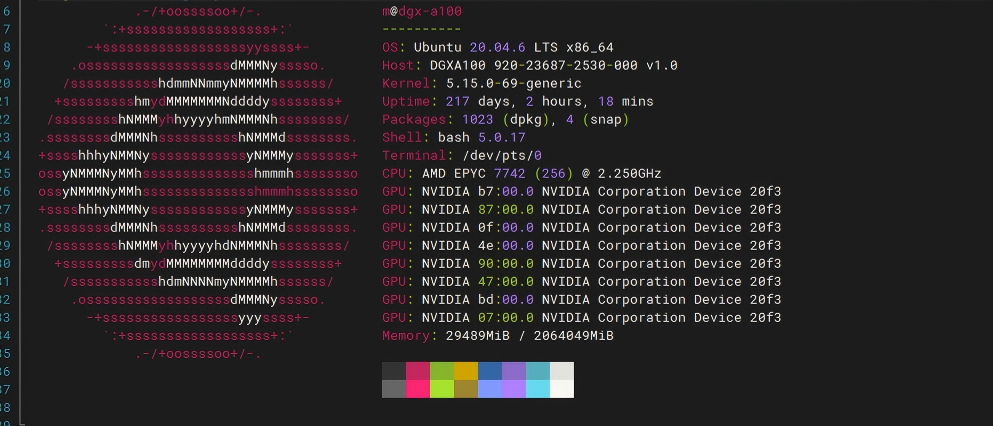
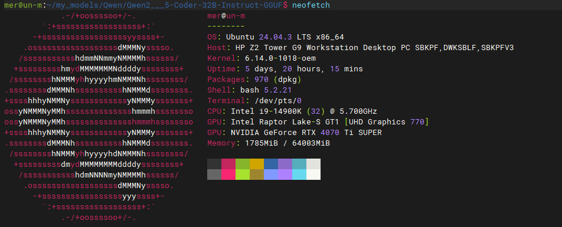

# N8n和ollma服务器上线

## 最新战果
*搞定了 *n8n服务器* 和 *ollma服务器* ，感谢各路大神的教程，现在开始调工作流程。*
<!--more-->

---
如果说最难的是什么，那就是下载Qwen模型了吧，不停地断线，还好我从魔塔下载到了。
感谢*魔塔*
目前计划是n8n执行定时任务，抓取数据，然后数据传给ollma形成标准化的报告。

**我的思路非常不成熟，走一步看一步。所以要记在这里。**

看看我的装备吧。
还额外装了webui，方便自己调试。

*下面ollma服务器，算力在自用算不错的了。*

*下面是n8n服务器，上面还跑着别的服务*

---

> 作者: Mavelsate  
> URL: https://blog.yeliya.site/posts/n8n%E6%9C%8D%E5%8A%A1%E5%99%A8%E5%92%8Collma%E6%9C%8D%E5%8A%A1%E5%99%A8%E6%90%AD%E5%BB%BA%E5%AE%8C%E6%AF%95/  

