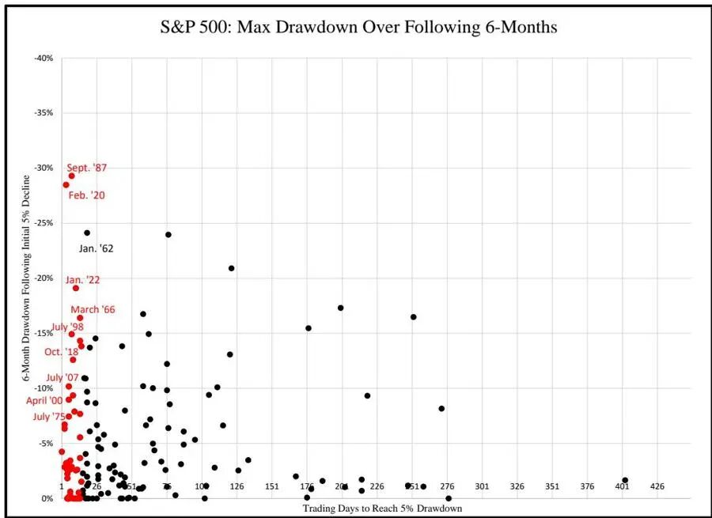
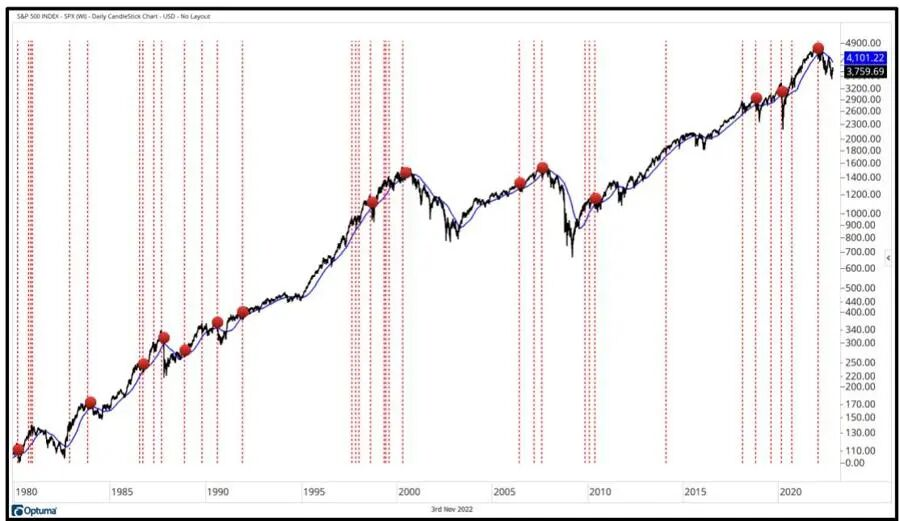
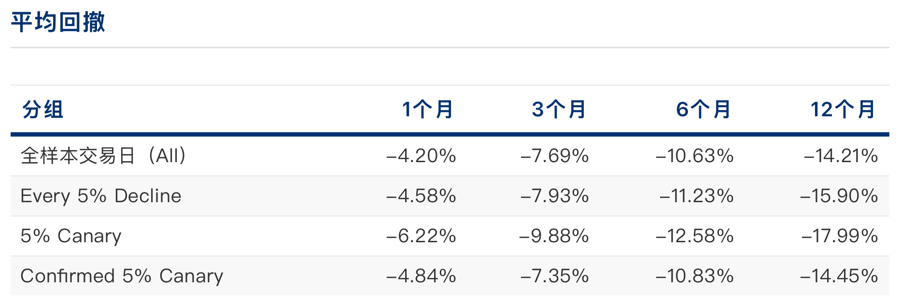
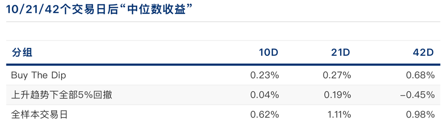

# 跌落的速度：5%金丝雀与被误解的抄底

每当市场跌去一点，总有两个声音在投资者的脑海里打架：一个是 “赶紧跑，后面还有深坑”，另一个是 “好机会，千金难买牛回头”。

买入还是止损？这大概是交易里最古老，也最折磨人的核心问题。

传统的解题思路，总是盯着下跌的 “幅度” 或者是所谓的 “估值”。但在拿下 2023 年查尔斯・道奖（Charles H. Dow Award）的一篇论文《The 5% Canary》中，作者 Andrew Thrasher 给出了一个极其锐利的新切口：​**时间**。

更准确地说，是下跌的​**初始加速度**。

## 危险的“早发速度”

标普 500 指数自 1950 年以来，有 90% 的时间都处在某种程度的回撤之中。绝大多数的日常回撤，都在 2% 到 6% 之间徘徊。对于长期投资者来说，这个区间的波动是不必理会的白噪音。

但问题在于，那些最终演变成 20%、甚至 30% 的灾难性大熊市，最初也是从跌破 5% 开始的。我们如何区分一次 “良性调整” 和一次 “崩盘前兆”？

Thrasher 从 17 世纪最速降线（Brachistochrone curve）的物理学原理中找到了灵感。物理学告诉我们，物体在一个曲线轨道上下滑，要想在最短时间内到达终点，并不是走直线，而是走一条前期极其陡峭的弧线 ——​**依靠初始阶段极快的速度累积动能**。

股票市场也是如此。这篇论文的核心发现是：**真正具有破坏性的大跌，往往在最初的 5% 下跌时，表现出了极快的速度。**

如果一个主要指数（如标普 500 或道琼斯）从 52 周高点回撤 5%，仅仅用了​**不到 15 个交易日**，这就触发了所谓的 “5% 金丝雀（5% Canary）” 信号。

在早年的煤矿里，矿工会带着对一氧化碳极度敏感的金丝雀下井。一旦金丝雀出事，矿工就知道毒气来了，必须立刻撤离。15 天内极速暴跌 5%，就是资本市场的金丝雀。

因为这种极速下跌打破了市场的常态，它意味着抛压极其坚决，没有任何承接盘。更致命的是，基于行为金融学中的 “注意力驱动（attention-driven）” 效应，这种急速的下跌会迅速吸引全市场的目光，唤醒投资者的损失厌恶本能，从而引发更猛烈的非理性抛售。

从历史数据看，结果一目了然。下面这张标普 500 的散点图，横轴是跌满 5% 所用的天数，纵轴是随后 6 个月的最大回撤。

###### 图：标普500指数跌幅达5%的时间与后续回撤的关系。红点为15天内急跌的样本

你可以清晰地看到，那些在图中下方的巨大深坑（包含大萧条、1987 股灾、2000 年互联网泡沫、2008 年金融危机以及 2020 年疫情熔断），绝大多数都伴随着初期极快的下跌速度（红点）。

## 确认与过滤

当然，市场偶尔也会有无厘头的恐慌发泄，随后迅速收复失地。为了过滤掉这些噪音，论文引入了技术分析中最朴素的工具：​**200 日均线**。

当 “5% 金丝雀” 发出尖叫（15 天内跌 5%）之后，如果指数在随后的 42 天内，出现​**连续两天收盘跌破 200 日均线**，这就构成了 “确认版的 5% 金丝雀（Confirmed 5% Canary）”。

均线在这里不是用来预测，而是用来确认趋势的破坏。

###### 图：标普500指数的“确认版5%金丝雀”信号，红点为触发位置

叠加了这个确认条件后，预警效果惊人。1980 年至今的标普 500 中，总共只出现了 15 次确认信号。而这 15 次信号之后，标普 500 未来 3 个月和 6 个月的中位数回撤，是普通 5% 下跌后回撤的两倍以上。

换句话说，当动能的恶化与长期趋势的破位产生共振时，千万不要心存侥幸。

### 慢跌中的“抄底”逻辑

既然极速下跌是毒药，那么如果是慢悠悠的下跌呢？

这正是这篇论文进入第二部分（Section Two）时的精妙之处 —— 它顺手把 “抄底（Buy The Dip）” 这件事给量化了。

很多人死在抄底上，是因为他们什么底都敢抄。牛顿在 1720 年南海泡沫破裂时试图抄底，结果倾家荡产，留下了那句著名的 “我能计算天体的运行，却无法计算人性的疯狂”。

但如果你改变一下条件：

1. ​**大背景是上升趋势**：50 日均线高于 200 日均线。
2. ​**下跌极其缓慢**​：从 52 周高点回撤 5%，花了​**超过 15 个交易日**。

当这两个条件同时满足时，论文将其定义为 “Buy The Dip” 信号。

这背后的逻辑依然是人性和微观结构。在长期多头排列的趋势下，如果一波 5% 的回撤走得磨磨唧唧，说明市场里并没有恐慌情绪。这往往只是获利盘的自然换手，或者是前期过热情绪的温和释放。

美股的数据证明了这一点。在出现这种 “慢跌抄底” 信号后的 42 天（约两个月）里，标普 500 上涨的概率高达 87.5%，中位数收益达到 5.55%，无论胜率还是赔率，都显著优于全样本的盲目做多。

这不在于盲目相信均值回归，而在于你通过时间的标尺，过滤掉了那种带有破坏性的情绪宣泄。

## A股的现实骨感

海外的实证做得很漂亮。但作为 A 股的长期受摧残者，看到任何神奇指标，第一反应永远是：在我们这儿管用吗？

我请 GPT 5.3 用万得全 A 指数（2006 年初至 2026 年初，近 5000 个交易日）作为标的，严格按照论文的参数跑了一遍复现。

结果很有意思，一半海水，一半火焰。

**首先，“急跌没好货” 这个底层逻辑，在中美市场是完全相通的。**

在万得全 A 的样本里，发生 “5% 金丝雀”（15 天内跌破 5%）之后的未来 1 个月到 12 个月，其平均回撤深度显著大于普通的 5% 下跌。动能的自我强化一旦开启，向下砸出的坑同样深不见底。在这个层面上，金丝雀的警报依然有效。

**其次，“确认版金丝雀” 在 A 股水土不服。**

论文中那个极具威力的过滤条件 —— 随后跌破 200 日均线确认 —— 在 A 股碰了壁。

为什么？因为过去十几年里，严格符合这一条件的仅仅只有 6 次。A 股的波动率本就偏高，牛短熊长，很多时候指数距离 200 日均线极远，或者在均线附近反复无序震荡。样本量太少，导致这个确认信号在 A 股失去了普适的统计意义。

**最后，关于 “慢跌抄底”。**

在万得全 A 中，上升趋势里的慢跌（耗时大于 15 天），其随后的上涨概率和中位数收益，确实比 “所有上升趋势下的 5% 回撤” 要有一定的边际改善。

但这仅仅只是 “有一点改善” 而已。它的整体表现，并没有比你在这个近 20 年的全样本里随便挑一天闭眼买入好。A 股没有美股那种长达十年的平稳慢牛，哪怕是温和的下跌，有时也只是漫长阴跌的开始，而非重新向上的蓄力。

## 写在最后

为什么同样的量化逻辑，在不同的市场会呈现出强度上的差异？

说到底，任何指标都是微观结构的倒影。成熟市场的平滑、长牛，让均线和时间过滤能够精确捕捉情绪的异动；而 A 股的高波动与资金博弈特性，使得很多趋势性指标显得要么过于迟钝，要么过于敏感。

但这并不妨碍我们从《The 5% Canary》中吸收最核心的思维操作系统。

**它提醒我们，面对市场的下跌，不要仅仅盯着那个 “跌了多少” 的绝对数字，更要感受它 “跌得有多快”。**

急跌释放的是恐慌的动能，而恐慌是极易传染的。

当市场以惊人的加速度飞流直下时，宁可承受踏空的代价，也不要去做那个试图徒手接飞刀的英雄。对市场保持绝对的敬畏，当金丝雀停止鸣叫，先退出来看看，总好过把本金留在深渊里去验证底部的坚硬程度。

---

> 作者: Mavelsate  
> URL: https://blog.yeliya.site/posts/%E4%B8%8B%E8%B7%8C%E7%9A%84%E5%8D%B1%E9%99%A9%E5%88%A4%E6%96%AD/  

