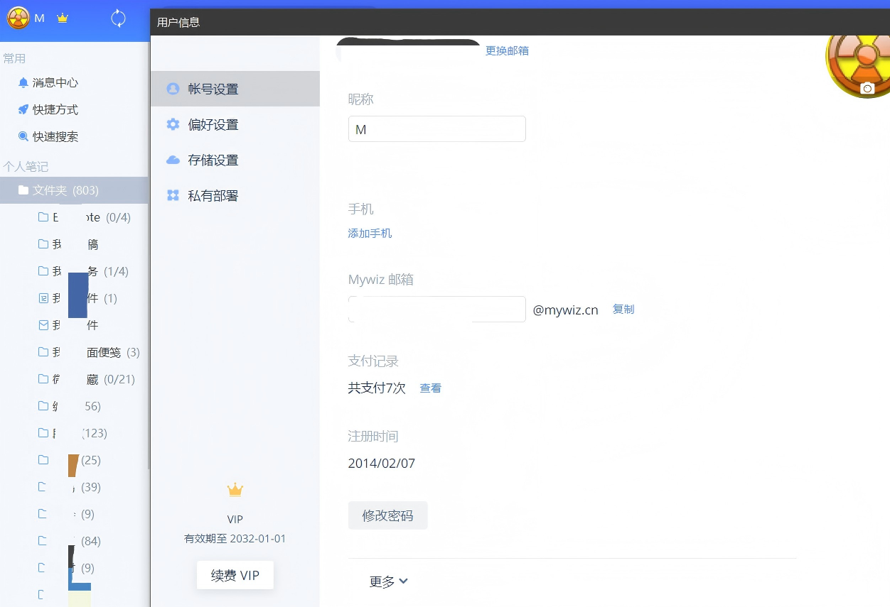
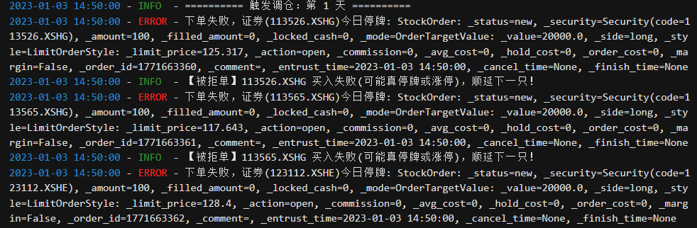

# 再见了为知笔记

## 第一件事
**也是最重要的一件事，我从为知笔记换到思源笔记了** 。

我是为知笔记的老用户了，14年就开始用了。

用过Evernote,有道云笔记，后来转到了为知笔记。中间还经历过为知笔记取消免费使用、版本更新混乱，放弃更新解散论坛等一系列事件。我现在仍然在坚持。

后来wiznote的浏览器插件在chrome上不能用了，提示不兼容，没关系，我改兼容模式，但是兼容模式的后果就是每次使用都要输入一次账号密码，我实在受不了，就用了EDGE，它还是老版本的插件系统。现在压死骆驼的最后一根稻草来了，最近这个插件不能收藏网页了，插件彻底不能用了。
>*对我来说，一个时代要结束了*。

现在挑了几天，确定了用大热门思源笔记，试用了几天以后，买了终身特性，就是可以导出到OSS的功能。

思源的思路和为知笔记完全不一样，首先它既是客户端又是服务端，可以在客户端打开端口让别的机器通过IP+端口来访问使用，也可以多端都装客户端共用一个备份仓库来进行同步。

缺点就是如果思源跑路，新设备就没法再登陆了，因为账号验证是在思源服务器上，虽然数据不在他的服务器。

为知笔记是可以做到账号也不走官网服务器，只连接自己部署的docker服务端。

怎么办呢，为知笔记现在太令人失望了。转到思源吧。我还在慢慢学着用，比为知麻烦不少。

## 第二件事
**我打算在聚宽，米筐之间选一家付费。**

主要是获取数据来跑本地策略，如果可以的话，我把QMT开了，自动化去跑交易。聚宽不支持可转债回测，

交易的时候提示```下单失败，可转债停牌```。





不过还是可以获取数据的，本地跑跑吧。两家我都再用用。

目前能够实现在线可转债策略回测的网站里
- 果仁网太贵了，也就可转债回测有吸引力，
- 禄得网的可选项太少，还容易报错。
- 因子猫可选项太少，收费也太贵。
- tushare数据据说有点问题，而且单独收费项目太多，200块钱买基础数据我能理解，但是可转债转股价调整这个数据还单独收费？还500一年？逗我玩呢？


## 第三件事
**给自己发了个愿，挣钱了买个VPS用一下**

主要是找了几家OSS，发现有一个OSS我没找到注册入口，linux.do上有这家介绍，但是我没账号，等我挣钱了买个邀请码。现在回头看看，我似乎不需要这么多OSS，而是需要一个VPS，买香港还是大陆的还没想好，再说吧。反正就是200M轻量云.

## 第四件事
**发现了几个神级网站**

[DangInvest](https://dang-invest.com)——这个是一个知乎大V的粉丝建立的站,主要是大V的日常发言和市场信息。

[读通鉴](https://dutongjian.com)——这个是一个知乎高手建立的站点，专门服务大家读资治通鉴的。

[可转债信息](https://kzz.suhom.cn/index.html)——很全的信息，实时度待测。

这帮大佬怎么这么聪明。羡慕❤

## 第五件事
**部署了一个openclaw。**

后来发现我并不需要这个，就又给干掉了。主要太占资源了，但是据说现在又有Rust写的openclaw了，有空试试看。

现在AI应用真的是进化超快，去年11月我还在研究MCP呢，现在skill都开始普及了。

## 第六件事

**打算买个软路由**

我用Tailscale从家连到办公室才8ms的延迟，这太爽了，独立公网IP就是舒服，

所以我打算买个六七百的软路由做个All in one耍耍，充分发挥公网IPV4/IPV6的优势，暂定7505，对我来说有两个SATA口+2.5G网口是刚需。当然除此之外，主板I/O接口越多越好。

## 第七件事

**域名解析还是要搞起来**

我已经规划了十几个服务了，目前已经达成了[OSS上传](https://upload.yeliya.site/index.html)和思源笔记，用着还行。

等软路由到了，用*lucky*做端口转发和域名DDNS就可以自由规划服务了，现在的8845HS主要还是做Jupyter吧，划出来一个LXC跑软路由太浪费了，也不好玩。


---

> 作者: Mavelsate  
> URL: https://blog.yeliya.site/posts/%E5%86%8D%E8%A7%81%E4%BA%86%E4%B8%BA%E7%9F%A5%E7%AC%94%E8%AE%B0/  

