# 可转债研究宝典

>一篇很好的可转债教程，算是我的入门教材，面对现在大牛市的行情，这个教程有点不合时宜了，但是温故知新。常看常新。我稍微修订了一下，改了下格式和行文，发在这里。
可转债的核心就是**三要素**，做可转债的核心就是**三知道**。
<!--more-->

*作者：郁言债市*
## 前言

转债的全称为可转换公司债券，既具备信用债定期支付的票息和本金等基本要素（纯债价值），又可在转股期内按照一定的规则转化为股票，从而获得对应份数的股权价值（转换价值），叠加赎回条款、下修条款和回售条款等附加条款的特殊期权价值，三者融合之下，使得转债产品成为了一种具有股债二重性的复杂衍生品。

转债在二级市场的定位非常清晰–核心是为债市提供补充收益来源，尤其是在收益荒日益严峻的当下；同时也可以为权益和混合投资者提供一个波动更温和、且下有底的投资选项，以及在正股仓位达到上限时，也可继续通过转债参与看好标的或板块的股性收益。

### 转债的基本要素及条款说明

投资者在初次接触到具体的转债个券时，我们需要重点关注的内容包括转债的发行规模、期限、信用评级等基本信息，转股条款和纯债条款等基础条款的设置，以及赎回条款、回售条款和下修条款等附加条款的设置。随着转债市场的不断发展，转债条款设置从早期的五花八门，到现在的几近一致，个券之间的差异化很小。

### 转债定价的基本研究思路

转债定价研究的第一步，是划分个券的股债性，以确认当前投资者用哪种定价思路更为高效。股性本质其实是转债价格对股票价格波动的敏感性，因此传统按照平底溢价率划分方法其实效率相对较低，我们更建议直接计算正股价格和转债价格直接的相关性和弹性来划分。同时，转债的股债特性不是一成不变的，会随着平价变化发生转换。 

在确认个券的股债属性后，对于股性较强的转债，分析的重点有两点：最核心的驱动是转债正股的走势，分析方法与权益类资产的思路一致；另一个核心关注点则是转债的估值指标——转股溢价率，需要综合考虑正股预期、纯债收益、流动性，以及转债供需关系、机构行为等因素，判断当前估值水平是否合理，并结合正股信息综合对转债价格做出判断。

对于偏债型品种，转债价格=纯债价值*（纯债溢价率+1）的定价模式下，衍生出两种经典的配置策略。一是纯债底仓策略，在意纯债条款带来的票息价值以及充分的债底保护。二是低价配置策略，基本的债底保护下，更在意纯债溢价率大幅提升的可能性，如正股具有爆发潜能或下修有较高概率能够落地。

*风险提示：权益市场风格加速轮动；转债市场规则出现超预期调整等。*

本篇报告是可转债研究宝典系列报告的第一篇。随着转债逐渐成为“固收+”投资的核心资产，其投研框架也在不断迭代，这使得市场上大量研究框架已经略显陈旧。据此，我们将从更加“现代”的角度，对转债基本特性、条款细则、定价思路、常用策略、参与者结构等多个角度进行详尽介绍。作为系列报告的第一部分，本篇报告将从零开始介绍转债的基础入门知识，帮助投资者迅速了解我国可转债产品的特性。在随后的报告中，我们将分专题继续就转债产品的方方面面，展开深入讨论。

## 01 初识转债，需要了解的事

### 1.1 转债第一印象：具有股债二重性的衍生品

转债的全称为可转换公司债券，结合名称直观理解，其基本特征是一种可以转换为股票的债券，这也是转债与普通信用债的最大区别。需要注意的是，转债产品的转股权是投资者的一种权利而非义务，投资者既可以选择行使转股权，将手中的转债转换为股票，也可以选择将转债作为一只债券持有至到期。这即是说，投资者在持有可转债时，可以灵活选择其作为常规债券或股票的两种价值，从而使这种债券具备了独特的“股债二重性”。

我们先从比较容易理解的公司债券角度出发，转债的基础设置与常规信用债类似，票面价值统一设置为100元，且同样需要面临还本付息的刚性约束。差异之处则包括

- （1）转债票面利率均采用累进制，前几年利率明显低于同等级同期限信用债，高补偿利率集中在最后一年还本节点；

- （2）转债发行期限大多统一设定为6年，信用债则分化较大；

- （3）转债准入条件相对而言更为宽松（2年交易经验&且权限开通前20个交易日日均资产不低于10万元）等。

而在“可转换”属性方面，转债可以在转股期内按照面值/转股价的比例转换为股票（对应的股票通常称为正股），由于转股价格相对固定，一张转债（面值100元）能够转换成的股票张数在不调整转股价的前提下也是确定的，这些股票的价值会随着正股股价波动而变化（转换出股票的价值通常称为平价或转换价值），转债价格也因此在很大程度上会受到转出的股票价值影响。从这个角度来看，转股权本质上可以视为一种看涨期权。此外，我国的转债产品通常还设置有赎回条款、回售条款和下修条款等附加条款，这些条款基本会影响到看涨期权的价值。

总结来看，转债既具备信用债的票面属性，具有定期支付的票息和本金等基本要素（纯债价值），又可在转股期内按照一定的规则转化为股票，从而获得对应份数的股权价值（转换价值），叠加赎回条款、下修条款和回售条款等附加条款的特殊期权价值，融合之下，转债产品成为了一种具有股债二重性的复杂衍生品。
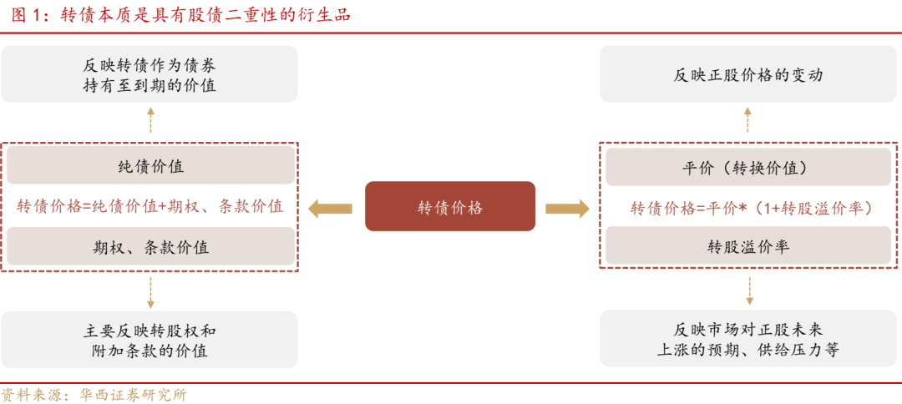
股债二重性决定了转债风险收益比介于股债之间，且转债也有效补充了中低波动中等收益产品的空缺。纯债+美式看涨期权的特殊组合使得转债定价同时会受到股价、纯债价值的影响，继而转债风险收益属性也会基于二者之间。从资产实际表现来看（2019.1.4-2025.5.16），转债波动率以及收益率的确高于纯债，低于股票，且风险收益比更偏向权益。值得注意的是，我们发现股债商主流指数当中，除南华工业品指数，仅有转债指数位于波动率5-10%的这一中低波动区间中，且转债预期收益更高。这意味着，转债有效补充了中低波动中等收益产品的空缺，成为资产配置当中重要一员。

### 1.2 哪些投资者在买转债？

尽管转债风险收益属性更像权益，但转债主要参与者却来自于债券市场。从2025年5月沪深交易所转债持有人数据以及公募基金2025年一季报的情况来看，转债市场最主要的参与者是公募基金，同时企业年金、保险机构、券商自营&资管以及私募基金等机构投资者也是转债市场核心参与力量。其中，我们对于公募基金持有转债的产品进行拆解之后发现，一、二级债基，转债基金等偏债类基金是最主要的产品类型。同时，企业年金、保险机构本身便是纯债市场核心参与者，足以佐证转债主要参与者来自于债券市场。
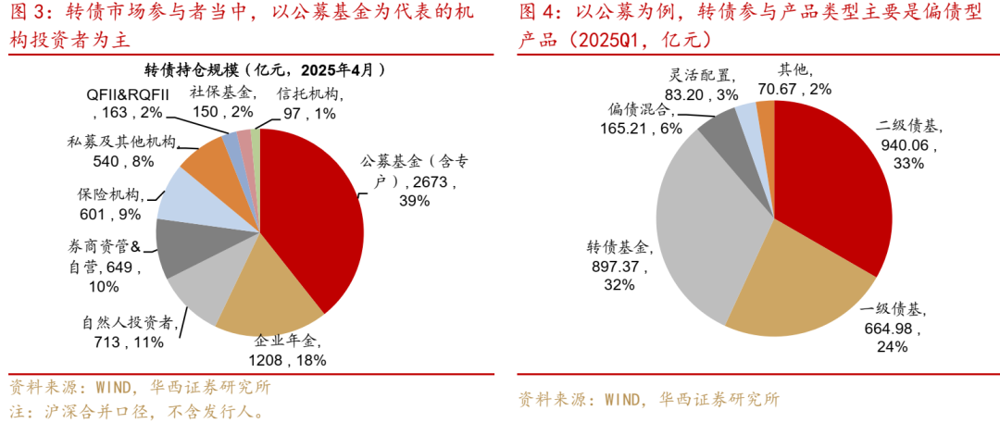

那么，转债为何得到债市投资者的青睐？一个重要前提，对于绝大多数固收+产品而言，转债的身份认定是债券，转债在能博取股性收益的同时并不会占用权益仓位。尤其是一级债基，本身不具备直接参与股票二级市场投资的权限，为了博取权益市场收益，只能通过转债产品来参与。即使是在可以参与股票投资的二级债基和偏债混合基金当中，转债也不会占用权益仓位。从实际情况来看，大多数产品并不会单独约束转债仓位，将转债仓位和股票仓位共同管理的产品就少之又少。

另一个核心要素是转债价格向下具有债性保护，这对于先天风险偏好较低的固收投资者来说提供了一个非常重要的定心丸。固收+产品的定位是纯债收益增强，但生命线却是回撤控制的能力。转债中低波动且债底保护的属性与先天风险偏好较低的固收+产品较为契合。此外，很多固收+产品在股票仓位并未填满的同时，还大力配置转债，则看重了转债回撤空间相比于股票更可控。
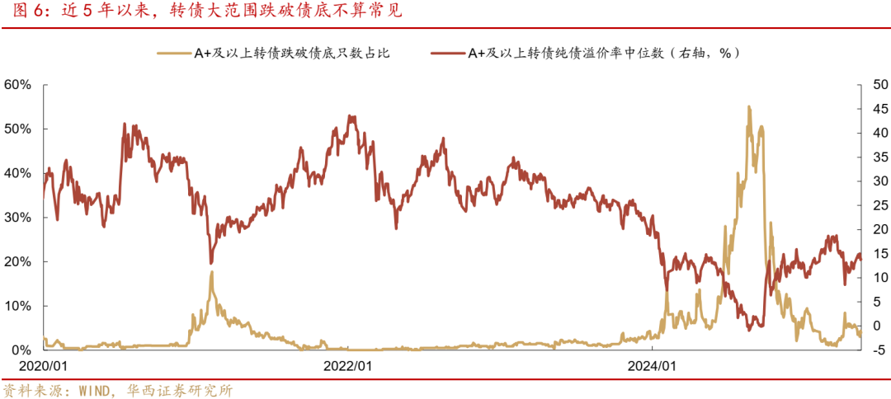

### 1.3 转债的市场角色：债市补充收益来源

综合基本属性和参与者，转债在二级市场的定位已经非常清晰——核心是为债市提供补充收益来源，尤其是在收益荒日益严峻的当下；同时也可以为权益和混合投资者提供一个波动更温和、且下有底的投资选项，以及在正股仓位达到上限时，也可继续通过转债参与看好标的或板块的股性收益（转债市场虽规模相对有限，但基本上各大行业均有标的分布）。
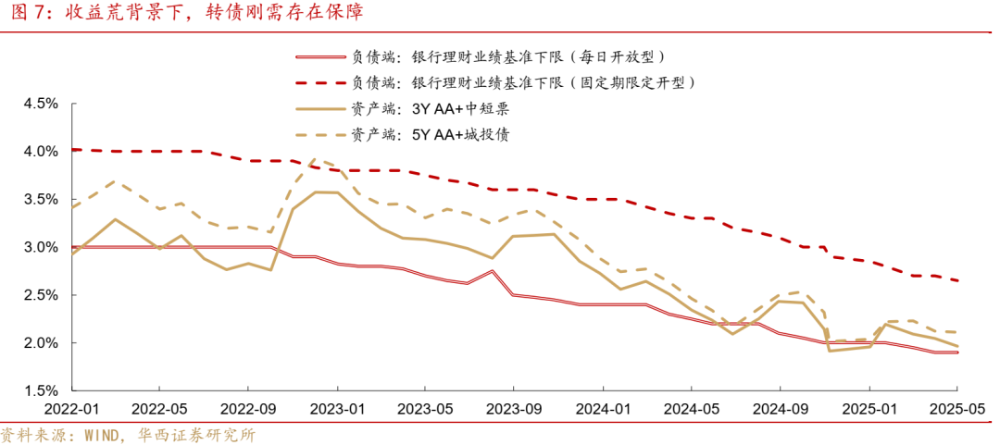
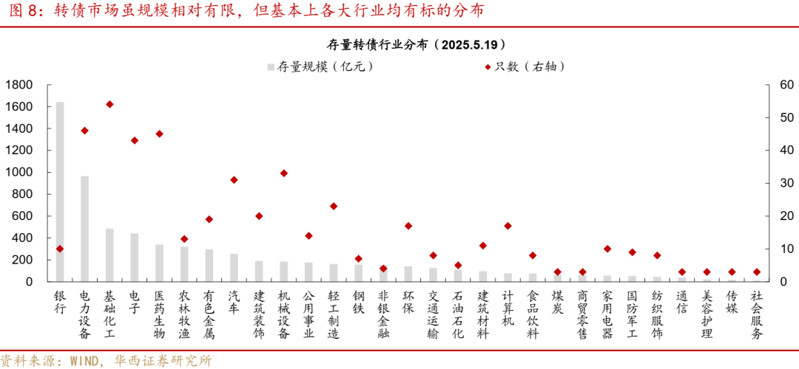

## 02 转债的基本要素及条款说明

投资者在初次接触到具体的转债个券时，我们需要重点关注的内容包括转债的发行规模、期限、信用评级等基本信息，转股条款和纯债条款等基础条款的设置，以及赎回条款、回售条款和下修条款等附加条款的设置。随着转债市场的不断发展，转债条款设置从早期的五花八门，到现在的几近一致，个券之间的差异化很小。为方便理解，本章我们将主要以较为具有代表性的高等级&大规模个券亿纬转债(171.434, 3.44, 2.04%)为例，对具体内容进行说明。下图展示了亿纬转债的完整条款设置。
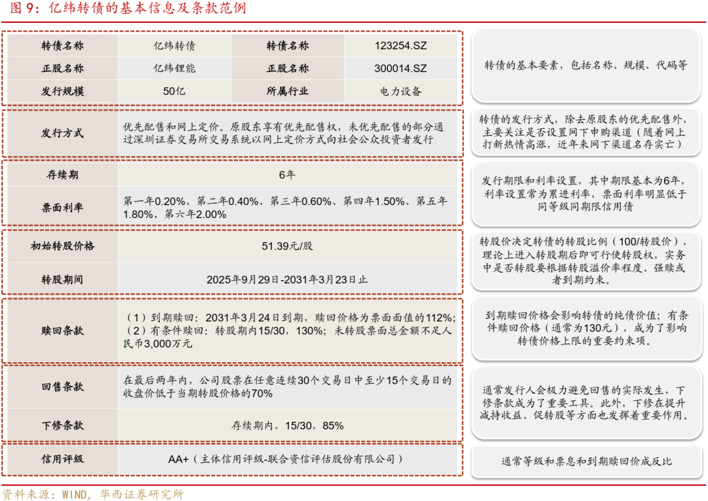

### 2.1 基本信息：我们首先应该看什么

基本信息方面，我们需要首先关注的通常是正股信息、发行规模、发行期限、信用评级等。

- **正股信息**
  
  转债正股价格是决定转债价格走势的重要因素，因此我们需要首先对转债的正股建立基本认识，以便后续展开研究。转债的正股分析方法与权益类证券的行业和公司分析方法基本一致。正股的主营业务、商业模式、行业趋势、竞争格局、产业链位置、财务报表、估值水平等因素均是我们需要研究的重点。
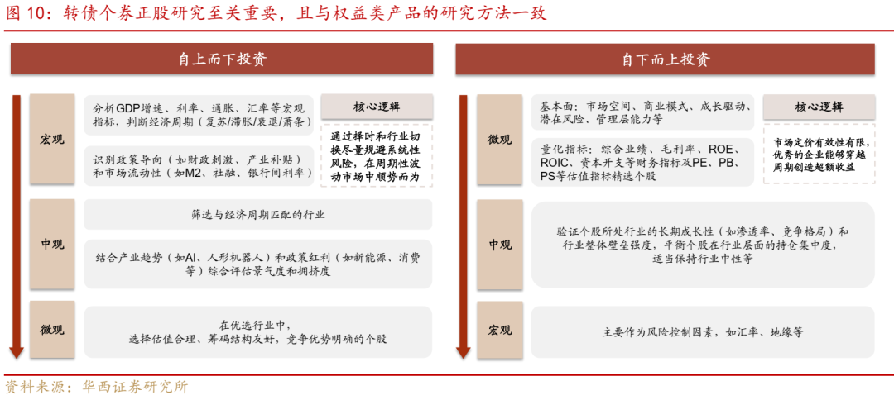

- **规模**
  
  转债规模在转债整个生命周期均至关重要。发行时，规模越大的转债，理论上打新中签率越高。但在上市时，规模越大的转债反而可能面临的是估值折价，这主要是因为参与打新的投资者在上市之初倾向于尽快将转债卖出兑现，规模较大的转债面临的抛压较重，而转债市场整体成交活跃度普遍不及正股，短时间内可能难以充分承载交易摩擦，难免存在折价压力，尤其是正股热度较低的大票。不过，对于资金体量较大的机构投资者而言，如果看好该个券的中长期价值，此时正是短时间内配置足够份额的理想时机。与之对应的是，规模较小且具有题材热度的新券，常常会受到私募基金及自然人等灵活资金的青睐（这些投资者也是转债市场流动性的主要提供者），从而还会得到流动性溢价。存续期间至退出时，未转股的转债规模如果仍然较大，则可能会影响发行人强赎的决策（担心集中转股的冲击以及筹措赎回资金的压力）以及到期偿还的压力。

  从2020年以来的转债发行情况来看，绝大多数存量债的募集规模均处在10亿元以下的区间（数据截至2025年5月19日），其中规模在0-5亿元的品种占31%、5-10亿元的品种占38%。规模在10-20亿元和20-100亿元的品种占比分别为16%、14%，而规模在100亿元以上的品种仅占1%。若按照规模对转债流动性的影响进行粗略划分，通常认为发行规模在10亿元以下的转债属于规模较小的品种，规模在10-20亿元的转债属于中等规模品种，而发行规模在20亿元以上的转债则属于大额品种。

- **期限和等级**
  
  目前转债的发行期限已经相对固定，绝大多数转债的发行期限为6年，另有少量转债将期限设置为5年。6年的期限设置给了发行人充足的转股时间（毕竟目前所有退市转债的平均生命周期不足3年）。

  而在等级方面，信用评级对于转债实际违约风险的参考性其实并不强，这是因为无论什么等级的转债产品，其发生实际违约的可能性都很低。由于转股权和各种条款的存在，转债票息设置通常已明显低于同等级的信用债。

  信用评级对于转债的更重要影响在于，机构入库/出库的刚性条件。例如，在入库时，保险机构常常只能参与配置AA及以上的转债，而公募基金则大多数可以将要求放宽至A+附近（也有将A或者AA-作为底线的机构）。此外，一旦转债评级发生变化，如每年6月常见的评级下调潮，包括将转债评级展望调至负面，均可能使得个券遭遇强制性出库。

### 2.2 基础条款：转股条款和纯债条款

接下来进入到转债产品特有的关键环节，一只转债究竟如何转股？首先，《可转债管理办法》规定公募转债自发行结束之日起不少于六个月后方可转换为股票。实务中，绝大多数转债的转股期设置在发行6个月之后，而个别转债如环旭转债(139.935, 1.18, 0.85%)则设置在9个月之后。

其次，每一只转债在发行时都会确定初始转股价格（除下修或者增发等事项之外，在转债生命周期当中是恒定的），初始转股价通常规定，不得低于募集说明书公布前一交易日股票交易均价与发行前20交易日股票交易均价的孰高者 （一般会与这个价格相等，理论转债初始平价为100元，与面值相当） 。在进入转股期后，转债即可随时按照面值——100元除以转股价的比例转出对应张数的股票，需要注意的是，投资者在下一个交易日才可将转成的股票卖出。

>注：部分公司发行转债时会存在一个约束，尤其是国企：转股价不得低于每股净资产，这样的目的可能是防止国有资产的流失。

以亿纬转债为例，目前其转股价为50.89元/股，那么在发行六个月后，即2025年9月29日起，亿纬转债的持有人便能够以100/50.89的比例，用每1张持有的转债转换出约1.97股亿纬锂能(70.990, 1.86, 2.69%)的股票，并得到这些股票的市场价值。实务中，深交所转债转股的最小申报单位为1张，上交所则为10张（1手转债），转换后不足1股的部分。发行人将通过中证登现金结算。

那么，是否当正股价格上涨至超过转股价的水平，并且转债处于转股期内，转债持有者就会选择转股呢？其实不然，即便是在正股价格高于转股价格的情况下，由于票息+潜在的向下保护，叠加债市投资者需要借助转债来获取弹性收益的流动性溢价，转债产品的市场价格通常会相较其平价存在一个正的转股溢价率，这就意味着若此时选择转股，那么得到的股票市场价值（即平价）将低于转债的市场价格，得不偿失，损失的幅度其实就是转股溢价率。

那么，转债持有人会在什么情况下选择转股呢？

- （1）发行人执行强赎促转股：通常当转债平价在转股期内持续超过130元后达成（后文中将详细介绍），转债价格也基本处于130元以上。在这一情况下，对于转债持有人而言，如果不选择转股，转债发行人将有权用很低的价格（约100元）将转债从持有人手中赎回，因此，理性投资者均会选择转股来获得更多的价值。

- （2）转股期内出现负溢价套利机会（多出现在正股暴涨，但转债较为谨慎，或者转债强赎之后，溢价率大幅收敛阶段）：当转股溢价率为负时，转债的平价已经高于市场价，选择转股将会得到更高的价值。因此若转债在转股期内出现了负溢价，投资者便可通过买入转债再转股卖出的形式进行“套利”，这样的策略被称为负溢价套利。之所以“套利”二字要加上双引号，是因为转出的股票需要在下一个交易日才能卖出，持有人在参与负溢价套利时，仍会面临股价波动风险，因此这一策略并不算严格意义上的套利。

- （3）转债到期，转债到期，且平价高于到期赎回价：若转债面临到期，那么转债持有人的选择仅有两个，一是接受转债的到期赎回价；二是选择转股。因此，当平价高于到期赎回价时，转股就会是更好的选择。

- （4）还有一种特殊情况是，转债临近到期，但发行人难以筹措足够的兑付资金，发行人可能会采取溢价转股的模式来降低偿还压力：发行人利用现有的资金，在二级市场主动买入转债，再转股卖出来回笼资金，以此往复。例如，A转债余额10亿元，转债价格100元，平价80元，转股溢价率25%，而发行人货币资金仅有8.5亿元，不足以完全兑付，那么假设发行人可以拆借到1.5亿元的隔夜资金，发行人可以利用这10亿元（8.5+1.5）买入转债转股，得到价值8亿元的股票，次日卖出回笼资金。此举不仅解决了转债偿还问题，偿还1.5亿元的借款之后，还能余下7（8.5-1.5）亿元的资金（未包括冲击成本、借款成本）。转债市场相关实际案例有海印转债、洪涛转债等。
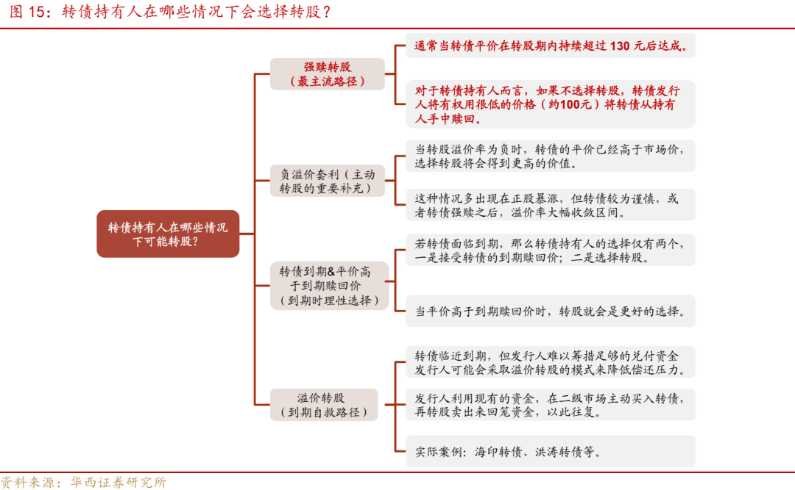

除了转股条款，转债的另一基本条款同样需要关注：纯债条款。转债的纯债相关条款决定了其作为一只债券本身价值，这一价值被称作转债的纯债价值。转债通常采用累进利率设置，同时转债产品通常会在最后一期给予高额的到期补偿，使得转债的到期赎回额显著高于最后一期票面利息+本金。以亿纬转债为例，其6年的利率设置分别为0.2%、0.4%、0.6%、1.5%、1.8%和2%，到期时还有10%的到期补偿，到期时将按照票面价值的112%进行偿付，即112元。需要注意的是，此处的利率为发行人实际的现金流支出，但在财务报表中计提财务费用的利率则不会这么低，通常会选取公司同期限的贷款利率或同资质的信用债利率作为参考基准。

累进利率的设定能够在一定程度上促进转债发行人的促转股意愿。若在转债的生命周期早期达成转股，那么发行人便不必再支付后续越来越高的票息与到期赎回时的补偿金额和本金。因此，通常发行人希望转债(105.823, -0.02, -0.02%)能够尽早促成转股。

转债的纯债价值一般由现金流贴现法进行计算，分子端即为票面利息+本金+到期补偿，折现率则通常采用对应期限和主体信用评级的中债公司债到期收益率。特别提醒，随着转债存续时间增加，其剩余的票息会越来越高，并且最后一期到期赎回补偿的折现因子也会变小，导致转债的纯债价值会随着剩余期限的消耗而增加。
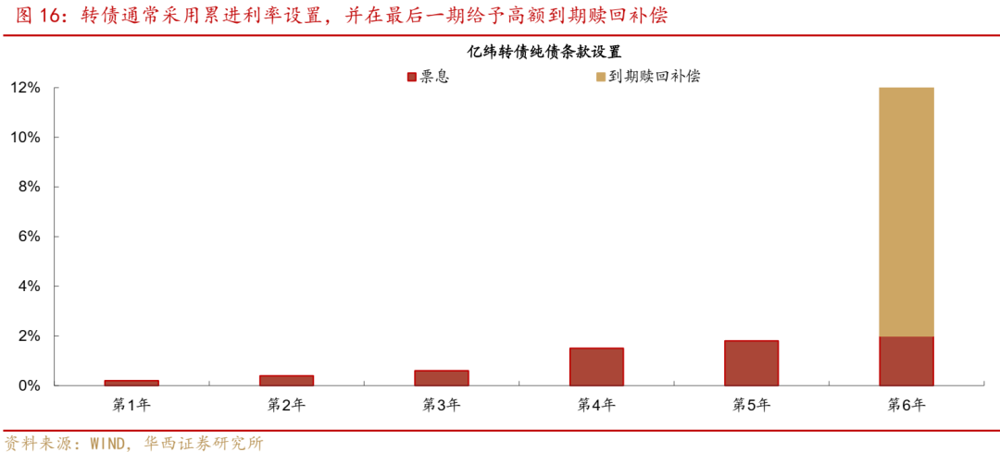

通常情况下，纯债价值可以视作转债价格的理论下限。由于转债产品的票息很低，历史上也极少出现违约事件（转债存续期间的违约范例仅有岭南转债(71.372, 0.00, 0.00%)），因此纯债价值常被视作转债价格的坚实底线，价格跌破债底的情况并不多见。

但在一些特殊情况下，转债也存在跌破债底的可能性：（1）市场认为发行人具有实际违约风险；（2）发行人有被调低信用评级的风险（意味着未来计算纯债价值的贴现率会升上，现有的纯债价值很可能下降）；（3）发行人出现影响较大的负面事件，造成转债的短期抛售；（4）转债市场遭遇流动性冲击等极端环境下，部分资质较弱的个券也可能会跌破债底。其中，在第三、第四种情况下，随着市场行情好转，或者负面事件没有致使公司出现违约风险，转债价格跌破债底的局面也通常会得到修复。

### 2.3 附加条款：赎回&回售&下修条款 

国内的转债产品通常设有三项重要的附加条款：赎回条款、回售条款和下修条款，接下来，我们将逐一详细介绍。
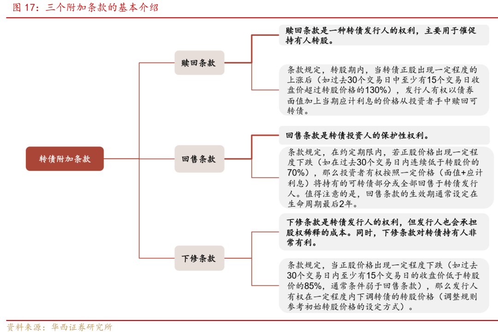

- #### （一）赎回条款：显著影响转债定价

  赎回条款理论上包括到期赎回条款和条件赎回条款，前者一般视作纯债条款的到期补偿，后者则是投资者常言的强赎条款，如若没有特殊说明，赎回条款等同于强赎条款。以亿纬转债为例，一个典型的强赎条款设置如下：在转股期内，若连续30个交易日中至少有15个交易日转债的正股收盘价不低于转股价的130%以上（即平价至少达到130元），公司有权决定按照债券面值加当期应计利息的价格赎回全部未转股的可转债。上述条款通常被简写为15/30、130%。当前的绝大多数转债产品都会采用与之相同强赎条款设置，仅少数公司会在天数要求和价格限制上做少量调整。例如，飞凯转债将正股价格的触发线设定在了120%，三角转债(134.907, 1.33, 0.99%)则将赎回触发时间延长至20个交易日，即20/30,130%，提升了达成强赎条件的难度，晨丰转债(153.032, 0.00, 0.00%)则甚至要求连续30个交易日平价不低于130元才可触发强赎。

  正如前文转股条款部分中提到的，强赎条款的真正意义并不在于从持有人手中赎回转债，而是促进持有人转股。由于转债转股溢价率通常为正，投资者主动转股的意愿非常有限，而上市公司发行转债的初衷即是转股，到期还钱甚至可能被视为一笔失败的融资，尤其是银行转债。那么发行人为了保护自身的权益，减少付息支出以及对报表费用的侵蚀，只能选择执行强赎来催促投资者转股。对于转债投资者而言，转股得到的股权价值通常远超赎回金额（略超100元），面对强赎时，理性选择是卖出转债或者执行转股。

  实务中，发行人先会发布提前赎回的公告，决定执行强赎权，并且根据交易所要求，会留有15-30个交易日给投资者较为充足的卖出或者转股的时间，同时也会在公告中说明具体的转债最后交易日及最后转股日，正式赎回日则通常为最后转股日下一个交易日。在赎回日临近时，转债剩余的额度通常都将悉数转股。较为遗憾的是，长期以来一直有转债持有人忘记转股，或者对强赎条款理解有偏差而未选择转股，以至于在赎回日时，将不得不接受相比转股价值显著更低的强赎价，从而面临大幅亏损。这对于发行人而言其实也是损失，将不得不拿出现金来赎回兑付这些未转股的转债。

  为什么投资者如此重视强赎条款？直接原因是强赎会导致转债投资者丧失继续持有转债的权利。更重要的原因其实是，强赎条款会对转债价格甚至正股股价产生显著影响。强赎对于转债的冲击主要分为三个层面:
  
  - 其一，原理层面，转债强赎之后，转债剩余期限大幅缩短，转债转股权蕴含的看涨期权的时间价值也随之减少，转股溢价率通常会快速从正值收敛至零附近，使得转债价格回调（同理，若转债公告暂不强赎，且此前转股溢价率已收敛至0%附近，则可能出现估值与价格的回升）。

  - 其二，机制层面，强赎会迫使持有人大量集中转股，但由于转债参与者多为固收投资者，受资管产品仓位约束，无法长期持有股票，且转债投资者也难以充分承受股票的波动，从而会在转股后卖出股票了结兑现。趋同行为下，正股将面临较大抛压，如若此前驱动正股上行的力量不能对冲抛压，则正股股价会出现调整。

  - 其三，市场层面，出于上述因素，大量转债在强赎后的确出现了显著调整（集中案例出现在2020年7月），投资者也逐步意识到强赎的冲击，进而形成了预期的自我实现：一是转债投资者如果观测到发行人强赎转股意愿较强，那么部分投资者会提前卖出转债以规避潜在下跌可能。同时，在强赎公告次日，尽可能早地卖出转债，来降低正股&转债的螺旋下跌风险；二是权益投资者也会根据强赎可能性做出对应举措，如在强赎公告次日，主动卖出股票来规避转债投资者后续的转股抛压，或者在强赎公告落地之前，推迟加仓动作等。

  最后需要提醒的是，随着转债强赎行为的不断演化，发行人在达成强赎条件时并不一定会立刻执行，许多转债发行人选择了暂不执行，并约定三个月到一年不等的不赎回窗口期，甚至太阳转债、福能转债在到期之前也一直未主动执行强赎。在此，我们也试图分析了发行人选择暂不强赎的原因：
  
  - （1）未转股余额较大，担心集中转股冲击及股权稀释压力，呵护正股走势；
  
  - （2）发行人转债持仓尚未减持完毕；
  
  - （3）获取股债双方的市场关注度；
  
  - （4）执行强赎时，需要事先准备预估赎回款及手续费，来赎回潜在的最终仍未转股的转债，若发行人流动性相对紧张，可能会选择延后；
  
  - （5）上市公司之间，尤其是同行业公司，存在一定模仿和学习效应，当同时期转债多选择不强赎之时，发行人可能也会倾向于选择不强赎。
  
  - （6）个别股息率较高的上市公司，或许会权衡分红与转债票面的成本。

- #### （二）回售条款：除债底外，转债价格的又一潜在底线支撑

  回售条款是一种转债投资者的价格保护条款，它通常规定转债正股在出现一定程度的下跌时，转债持有人有权将转债按照约定的价格回售给发行人。以亿纬转债为例，一个典型的回售条款设置为：在转债的最后两个计息年度，如果公司股票在任何连续三十个交易日的收盘价格，低于当期转股价的70%时，那么转债持有人有权将其持有转债全部或部分，按面值加上当期应计利息的价格回售给公司。上述条款通常被简写为30、70%。需要注意的是，银行类转债通常不会设置回售条款。

  对于转债发行人而言，回售当然不是一个好消息，这意味着转债发行人将不得不提前偿还本息，而发行转债最大的优势本应是达成转股后便不需要偿付后续本息。因此，在公司面临转债回售压力时，通常倾向于采用一些手段（比如稍后会提到的下修转股价），尽力规避回售条款的实际触发。

  不过，回售条款通常仅在转债的最后两个计息年度才能触发，这意味着在转债发行后的前四年中，即便是正股出现了较大幅度的回调，发行人也不会面临实际的回售压力。同时也意味着，回售价格只有在最后两年才会成为转债的底线支撑（公司无实质违约风险）。当然，如果一只转债在进入最后两年之前价格跌破面值，投资者也可以根据回售价格和距离回售期的时间计算潜在收益率。

- #### （三）下修条款：初衷为规避回售，现主要用于配合减持和促转股

  下修条款规定，当转债正股价格达成一定条件后，公司可以下调自己的转股价。我们在前文中已经提到，转债发行人通常会尽力避免回售条款的实际触发，其中一个重要的手段便是运用下修条款来下调转股价。以亿纬转债为例，一个典型的转债下修条款设置为：当公司股票在任意连续三十个交易日中至少有十五个交易日的收盘价低于当期转股价格的85%时，公司董事会有权向股东大会提出向下修正转股价格的提案。上述条款通常被简写为15/30、85%。修正后的转股价格按规定，将不得低于股东大会召开日前二十个交易日公司股票交易均价和前一交易日均价（部分发行人还会要求，下修后的转股价格不能低于每股净资产和股票面值）。一般情况下，下修的价格触发线有90%、85%和80%三个等级，触发价格设置越高，则条件越容易达成。另有少量发行人将触发日期设置为10/20。此外，需要注意的是，下修是发行人的权利，发行人不一定会采取下修举措，尤其在意股权稀释且自身现金流充裕的公司。同时，发行人提议下修之后，还需要经过股东大会表决，存在下修失败的风险。
  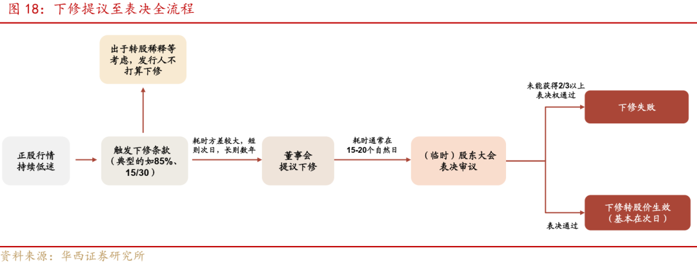

  下修条款之所以受到关注，是因为发行人主动下修执行后，转债转出的股票比例将相应增大，转债平价实现跃升，驱动转债价格上涨。据此，下修条款最直观的意义是防止回售条款的实际触发。若转股价下修被股东大会通过并顺利执行，那么转债的转股价将较原有转股价明显下调，平价回升至70元以上，回售条款“低于转股价70%”的条件便不能达成，从而避免了回售条款的实际触发。实务中，只要发行人提议下修并通过，回售条款便要重新累积进度，这意味着，发行人每次可以进行少量下修，哪怕不将平价抬升至70元以上，也可以持续规避回售。

  除规避回售这一传统动机之外，发行人也会在其他一些情况下选择下修，例如：（1）正股价格处在低位，但公司判断股价后续将迎来上涨机会，此时公司有可能会选择下修以降低触发强赎转股的难度，确保公司能顺利转股；（2）大股东持有大量转债，在正股价格处在低位时，出于解套目的，大股东提议下修的意愿可能增强。

  此外，除传统意义上的下修条款之外，发行人发生现金分红、转增股本、增发新股以及配股等股份调整事项，转股价格也会被动对应调整。绝大多数情况下，这些对平价影响微乎其微，但如果转债平价处于较高水平，如200元以上，那么大额现金分红则会对平价起到积极作用，反之，大规模定增则会使得平价受到折损。

  综上，我们分别单独介绍了转债各大基础条款及附加条款的主要内容，及这些条款对转债定价的影响。综合来看，并结合我们在上文提及的转债本质属性（具有股债二重性的特殊衍生品），我们对各大条款在转债定价的作用形成了新的理解：转股条款是转债具有美式看涨期权属性的核心要素，也是转债价格最为核心的驱动力(0.000, 0.00, 0.00%)。强赎条款则会提前结束转债生命周期，是深度实值期权的潜在敌人，可使得时间价值锐减（加速Theta损耗，Vega也提前收敛，让波动率无用武之地）。而下修条款的本质是下调行权价格（Strike Price），可以显著降低期权虚值的程度，从而提升期权价值。回售条款也可视作深度虚值期权的潜在补偿。纯债条款则使得转债从相对简单的看涨期权变成了更为复杂的特殊衍生品。同时，转股条款、纯债条款和回售条款共同构成了转债的底线价值。
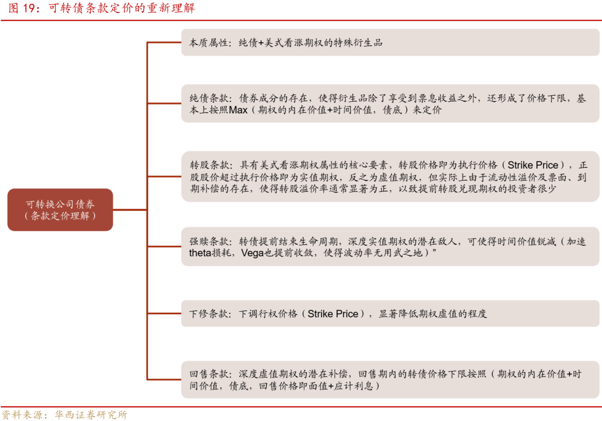

## 03 转债定价的基本研究思路

### 3.1 研究的起点：股债属性划分

在熟悉了转债的各类条款之后，我们便可以结合一些常用指标对转债价格的基本分析思路进行介绍。下图显示了转债价格随正股价格变化的过程，其中横轴为正股价格，纵轴为转债价格，红色的曲线代表转债价格，两条黄色的直线表示转债的纯债价值和平价。平价的计算公式为（100/转股价）*正股股价，由于转股价为常数，因此平价与正股股价呈线性关系。而纯债价值与正股股价无关，因此在图中呈水平的直线。
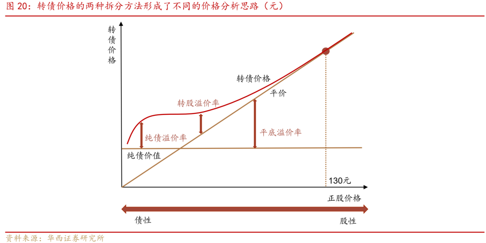

依据转债股性和债性的相对强弱，我们常采用不同的分解方法对转债的价格进行分析。通常情况下，当正股对转债价格驱动力较强时，我们认为转债的股性较强，此时转债的平价会明显高于纯债价值，我们也常采用以平价为基础的估值方法。而当正股对转债价格的驱动力不强时，我们认为转债的债性较强，此时转债的平价往往已明显低于纯债价值，我们通常采用以纯债价值为基础的分析思路。

传统习惯，我们可按照平底溢价率（平价/纯债价值-1）的相对高低，来对转债的股性和债性进行经验区分。从公式可知，平底溢价率直观反映了转债纯债价值和平价的相对高低。按照常用的经验标准，我们通常将平底溢价率<-20%的品种，划分为偏债型转债；平底溢价率>20%的品种，划分为偏股型转债；而平底溢价率在-20%~20%之间的品种，划分为兼具股性和债性特征的平衡型转债。

而在实际分析时，我们并不建议严格按照平底溢价率的标准对标的进行划分。因为划分股债属性的初衷是帮助投资者确认应该使用何种思路来开展针对性研究。而股性的本质其实就是转债价格对股票价格波动的敏感性，所以平底溢价率的传统手段实效性较低。例如，我们选取平底溢价率几乎相等的紫银转债(110.229, 0.08, 0.08%)、杭氧转债(147.832, 3.44, 2.39%)（截止2025年5月19日数据）作为统计对象，二者理论上均为典型偏债型标的（平底溢价率均明显低于-20%）。但实际上，我们会发现杭氧转债价格对平价较为敏感。因此我们若对杭氧转债和紫银转债同类方法分析，则可能会出现方向性错误。
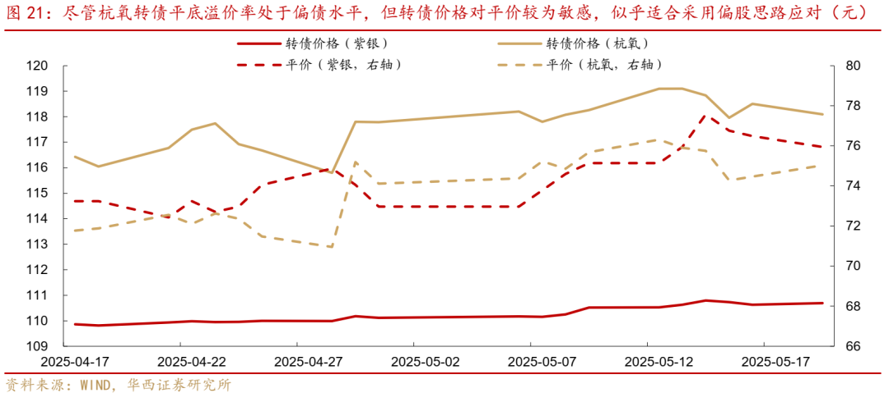

基于此，我们更建议直接计算转债价格和正股股价在近期的线性相关系数以及回归系数（也即弹性，转债价格为Y，正股股价为X的一元回归模型），来对转债的股债属性进行划分。其中，相关系数在0.8以上且回归系数在0.5以上的转债（高相关性、高弹性），无论平底溢价率如何，我们都建议用股性思路分析，因为实质上就是正股的波动在主要驱动转债价格。此外，对于相关系数&回归系数均较低的转债（低相关性、低弹性），我们则可以将其视作偏债型标的。对于相关系数较高且回归系数较低的转债（高相关性、低弹性），我们短期内应当更加在意正股的胜率而非赔率。对于相关系数较低且回归系数较高的转债（低相关性、高弹性），我们应当观察是否遭遇炒作资金侵扰，亦或是估值的主动压缩。尤其是相关系数为负的转债，可能在正股上涨之际消化前期过高的估值，转债逆势回调。
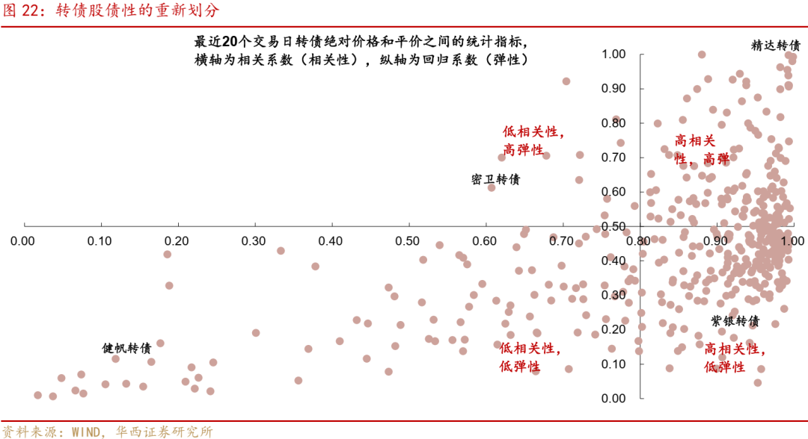

同时，转债的股债特性不是一成不变的，会随着平价变化发生转换，且平价越高股性越强。从原理来看，随着标的资产价格（正股股价）增加，看涨期权的delta（可以简单理解为股性）也不断增加。且我们还能发现delta变化的速度有一个先变大再变小的过程，在等于执行价格k（即转股价格）的那一点，delta变动最快。这其实也是gamma（简单理解为股性的弹性）的内涵，gamma在资产价格等于执行价格的时候最大。因为在执行价格这一点，标的资产价格细微的变动都会导致期权实值与虚值之间的转换，因此delta变动会相当剧烈。

举例来看，若一只转债平价仅有30元，转债价格为105元，那么即使正股股价翻倍，平价升至60元，其实也不会对转债价格有太大影响，股性也依然处于较低水平（对应下图股价从略超0轴的水平小幅增长，但delta提升不明显），转债定价便会向更高的债券价值靠拢。

若一只转债平价为75元，价格为110元（大体采用偏债分析思路），一旦正股出现30%上涨，转债平价来到100元附近，那么转债的债性会迅速转变为强股性（对应下图正股股价来到转股价格附近，delta会剧烈提升），从而使得估值定价逻辑也发生变化，转债价格也会出现明显上涨。

若一只转债平价为160元，那么其股性可能与平价200元的转债没有本质区别，这也是下图中显示的delta接近1之时，股价的增长对于股性的提升其实不大。

此外，发行人所处的行业市场关注度飙升等其他情况，也会让转债股性突然增强，这本质上是市场开始愿意为其正股波动定价。
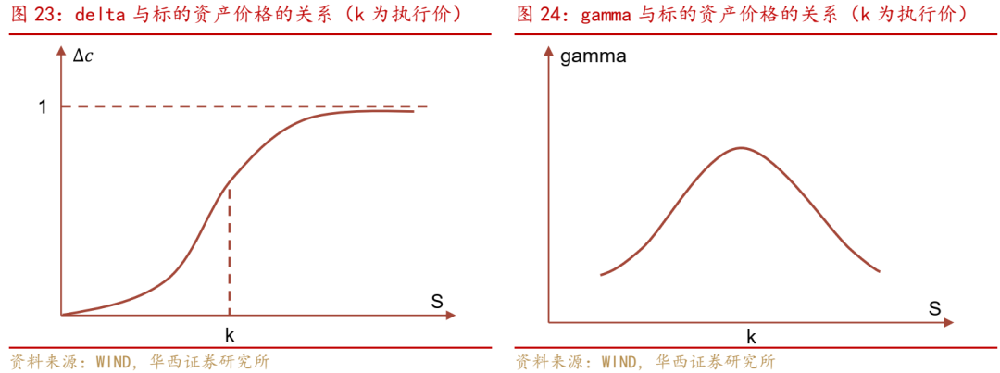

### 3.2 偏股型转债的研究方法

对于股性较强的转债，通常采用以平价+转股溢价率为核心的分析方法。我们在上文反复强调，且从图20中亦可看出，平价变动是转债价格最主要的驱动力，因此对于股性较强的转债来说，正股分析是其价格研究的核心内容。尤其是在当前市场中，随着转债常用策略被投资者逐步熟知，个券正股研究的重要性将进一步提升。由于转债正股的研究方法与权益类产品一致，且上文已简要提及，在此不做过多介绍。

除了正股价格走势外，分析中的另一个核心指标便是转股溢价率：

转股溢价率=转债市场价格/平价-1

转股溢价率即为转债价格超出转债平价的幅度。对于偏股型标的，它最主要反映的是市场对于转债正股未来上涨空间的期待，其实也是转债内嵌的看涨期权的时间价值。转股溢价率的内涵其实很好理解，当市场预期正股未来有上涨空间时，投资者的交易行为便会提前对这一部分预期进行反应，映射到转债价格上，便形成了其对于平价的溢价。转股溢价率也常被简称为转债的估值。

对于初步接触转债的投资者而言，通常会出现一个误区，即将转股溢价率当做一个单独的指标来使用。例如，股票估值PE、PB通常情况下同时具备横向对比和纵向对比的功能。PE高的股票，即使不叠加其他信息，我们基本上也可以判断该股票的估值更高。但单独使用转股溢价率，如果不配合平价指标，我们很难从中得到有用信息。例如，平价70元，债底105元，转债价格110元的转债A，对应转股溢价率为57%，平价100元，债底105元，转债价格157元的转债B，对应转股溢价率同样为57%，那么单独从转股溢价率反映出来的信息是A和B的估值相同。但显然，结合平价水平和实务经验，我们知道转债B的估值非常之不合理，A则基本上合理，B明显比A贵。因此，无论何时我们使用转股溢价率指标，均要结合平价指标来综合分析。

一般情况下，转股溢价率通常会随着正股价格的上升而逐渐收窄，并在强赎触发价附近收敛到0。因为转股溢价率主要反应了市场对于转债正股未来上涨空间的预期，但是若转债即将被赎回，那么正股未来的涨幅对于转债便不再有意义。因此转股溢价率通常在正股达到强赎触发价时（也就是平价达到130元左右），收敛到0%。这一过程也可以理解为市场预期的兑现与消化。而当正股价格突破强赎触发价后，转债价格与平价理论上将保持同步变动。

此外，我们在上文中提及，大量转债发行人在平价超过130元时，会选择暂不提前赎回转债，并在公告中约定不赎回窗口期。因此，对于不赎回预期明确的转债而言，即使转债平价远超130元，其转债价格依然可能会明显高于平价，留有较高的转股溢价率，且估值大体与承诺不赎回时间正相关，即不赎回窗口期越长，理论上估值越高。

简而言之，当正股股价上涨后，市场对其进一步上涨的预期便会调低，因此转股溢价率通常与正股价格呈反向变动。上述单纯由正股股价变动而导致的转股溢价率变化，通常被称作转股溢价率的被动变化。
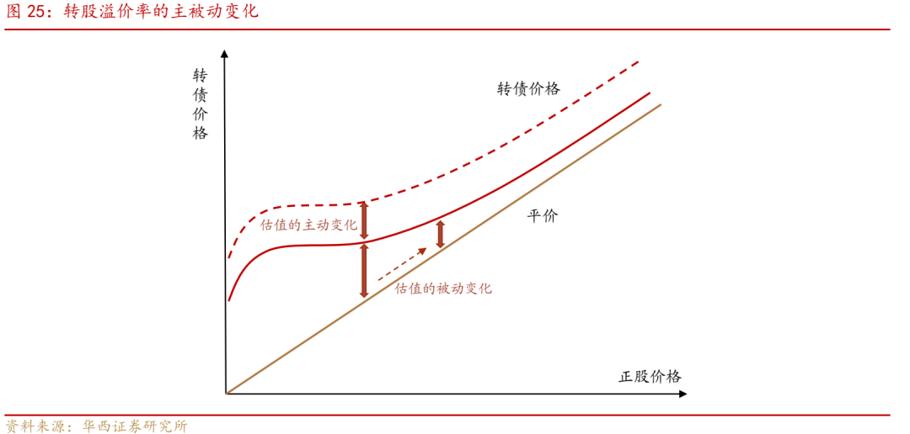

如果说转债估值的被动变化取决于对应个股行情，那么是否意味着权益投资者可以轻松跨界转债投资呢？其实不然，转债投资的能力圈，更多在于需要充分理解估值主动变化的背后因素，并做出后续方向性判断。

我们重新审视了现有的转债估值体系，认为其依然具备有效性。转债市场整体估值主要受三个方面因素的影响：正股预期（直接驱动）、纯债收益（替代效应）以及流动性（市场需求）。其中，正股预期可以理解为对宽基指数整体行情的预期，也包括与转债资产波动更为紧密的小盘股票风格的结构性行情预期，同时也包括类似于新能源、机器人(17.620, 0.08, 0.46%)之类的产业趋势预期。总之，转债投资者对于权益资产的未来乐观态度会显著影响估值变化，即使正股暂未兑现行情，依然会出现估值的主动拉伸。

纯债收益，我们在上文提及，转债主要参与者是固收投资者，绝对收益通常是主要考核目标。那么，当长端利率处于高位时，比如3%以上，资管产品使用传统固收收益增强的工具（拉久期、加杠杆、下沉资质）便可基本完成任务，无需再花费精力配置转债。而当长端利率处于低位时，比如回到2%以下，收益荒困境愈发严峻，存在收益上限压力的固收投资者，也只能介由转债来博取弹性收益。因此，纯债收益的本质其实是固收投资者参与转债投资的机会成本。此外，债市利率与转债纯债条款的贴现率直接相关，从而也会对转债价格底线乃至估值造成影响。

流动性，尤其是债市流动性充裕时，固收投资者在配置足够债券资产时，会考虑将多出的资金配置转债等固收+资产。但当流动性紧张时，如2021年初，则会对转债估值造成显著冲击。此外，转债市场成交活跃度相比于纯债更高，资管产品遭遇赎回压力，引发流动性冲击时，通常还会选择优先卖出转债来缓解资金压力。
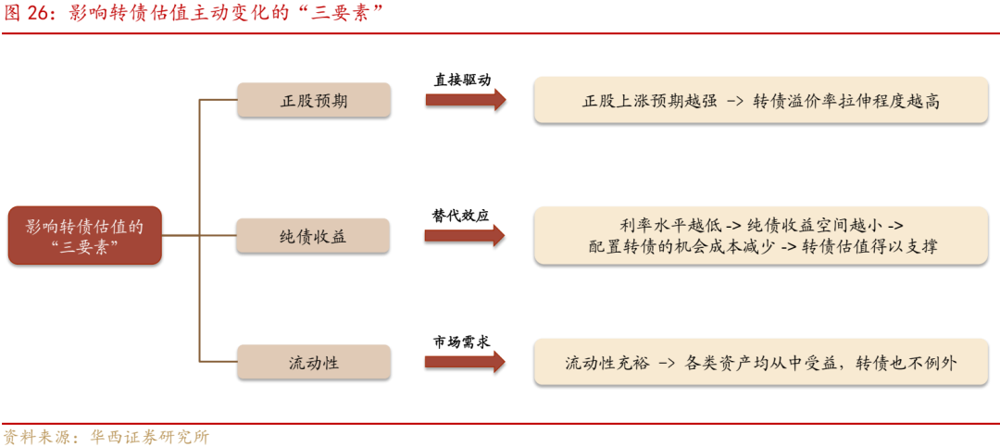

综上，对于股性较强的转债，我们分析的重点有两点：最重要的驱动因素是转债正股的走势，分析方法与权益类资产的思路无异；另一个核心关注点则是转债的估值指标——转股溢价率，需要综合考虑正股预期、纯债收益、流动性，以及转债供需关系、机构行为等因素，判断当前估值水平是否合理，并结合正股信息综合对转债价格做出判断。

### 3.3 偏债型转债的研究方法

在偏债型转债品种（正股驱动力较弱）的价格分析中，转债以纯债价值作为底价，相较于偏股型品种，具有更强的债底保护效应。纯债价值通常可视作转债价格的理论底部，若转债市场价格与纯债价值处在接近位置，那么偏债型品种价格下行的空间，实际上已经非常有限，这一效应被称作债底保护。转债价格与债底之间的差距常采用纯债溢价率指标表示：

纯债溢价率=转债市场价格/纯债价值-1

理论上，纯债溢价率主要包含了转股权与附加条款的期权价值，其中附加条款的价值主要体现在回售和下修条款上。转股权的期权价值主要体现在正股未来大幅上涨的可能性。回售条款则在最后两年与纯债价值一同构成了转债的底线价值（前提是个券无实质信用风险），因为一旦转债价格跌破回售价格，套利作用会快速抹平价值。因此，下修条款成为了纯债溢价率定价的重要因素。一旦下修充分，平价大幅上升，转债可能瞬间切换为偏股型标的，价格也会随之抬升。

在转债价格=纯债价值*（纯债溢价率+1）的定价模式下，衍生出两种经典的偏债型配置策略。一是纯债底仓策略，在意纯债条款带来的票息价值以及充分的债底保护。二是低价配置策略，在基本的债底保护下，更在意纯债溢价率大幅提升的可能性，如正股未来具有爆发潜能或下修有较高概率能够落地。

那么，看似朴素的纯债底仓策略，为何能够成为较多主流资管产品的常备选项呢？首先，纯债底仓策略的收益没有那么不堪，至少具有稳定性。在转债整体拉估值阶段，大体能跟上转债指数的基准行情。同时，部分底仓个券也是利率敏感型标的，还可以作为利率替代个券持有，博取利率下行及转债估值抬升行情。其次，固收产品对于波动较为敏感，配置抗回撤能力较强的底仓个券既可填补转债仓位，还可平滑产品波动。再次，投资者担忧后续行情转弱，也会通过配置底仓个券来防范风险。最后，底仓个券通常具备质押券的资质，投资者如果看好后续市场行情，可以质押底仓券获取资金，来给产品提升杠杆率。

低价配置策略作为偏债型品种的左侧配置策略，既是转债市场的经典策略，也是最能体现产品优势的投资策略之一。低价配置策略的本质是在债底支撑下，寻求转债的波动率放大带来的不对称收益。转债期权价值与正股隐含波动率正相关，那么，正股波动率放大时，期权理论价值也会提升。同时，期权价值也与正股价格显著挂钩，那么正股届时向上波动放大时，低价转债价格可以同时获得波动率和正股价格双重驱动，向上空间广阔。而当正股届时向下波动放大时，债底保护下，低价转债向下空间较为有限，这便是低价转债不对称收益的由来。简而言之，低价配置策略的投资者，通常会耐心持有，一直等待转债价格上升至目标价再兑现。其耐心主要来源于转债历史上大多数标的通过强赎转股退出，也即转债价格生命周期大概率会突破至130元以上，结合转债个券的退出耗时通常不足3年，低价配置策略显然具有实践的意义。

此外，转债市场时常出现的下修，也为低价配置策略提供了较为丰厚的补充收益。可能不需要正股大幅上涨，在下修的推动下，转债价格也能来到目标价位，从而兑现收益。不过，下修预判的难度不低且博弈已趋充分，须以“平常心”对待。下修属于发行人的权利，而非义务，并且发行人下修还会付出股权稀释的代价，常有转债长期处于触发下修条款状态却并未选择下修，因此案头研究的实质价值相对有限。同时，若大股东持股比例较高且持有转债，需加以回避，那么投票权可能集中在中小股东手中，而中小股东的意向又难以统计，这进一步加大了案头研究的难度。更重要的是，即使我们可以完美预判每一只下修转债，如果把握不好参与时点，可能并不能获取超额收益。因此我们完全不建议将下修博弈作为主力收益挖掘策略，更多是正常进行低价配置，静待持仓个券下修，配合个券基本面变化综合判断，并对已兑现下修收益的品种“见好就收”，避免承担不必要的市场风险。
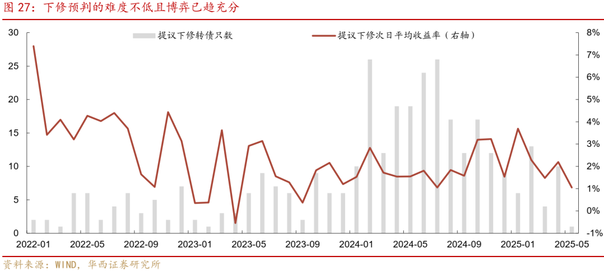

具体而言，在筛选低价配置品种时，首先务必要详细排查信用风险，且绝对价格尽可能接近债底（一方面期权价值低，错误定价概率高；另一方面理论回撤空间有保护），同时，转债正股波动率存在较强放大潜能。正股所处的行业要么是波动巨大的强周期行业（当前处于底部那种，博弈反弹，如2019年的锂矿行业），或者是正股业务涉及到潜在的强爆发行业/概念（如最近两年的机器人板块），亦或是正股本身具有波动放大的可能性（如资产重组），也可以是公司基本面存在困境反转可能性（如消费龙头）。最后，值得注意的是，利用YTM配合筛选转债个券的效率可能相对低下。高YTM转债发行人资质大多较弱，且投资思路其实更像高收益债，而非国内典型信用债，需要做到分散配置&及时止损。更重要的是，对于当年有迫切绝对收益考核的投资者，由于票息收益显著非线性，配置高YTM转债并不一定能满足投资者刚性收益需求。换言之，除非投资者的确打算持有该标的至到期，否则无需过度参考YTM的绝对值。
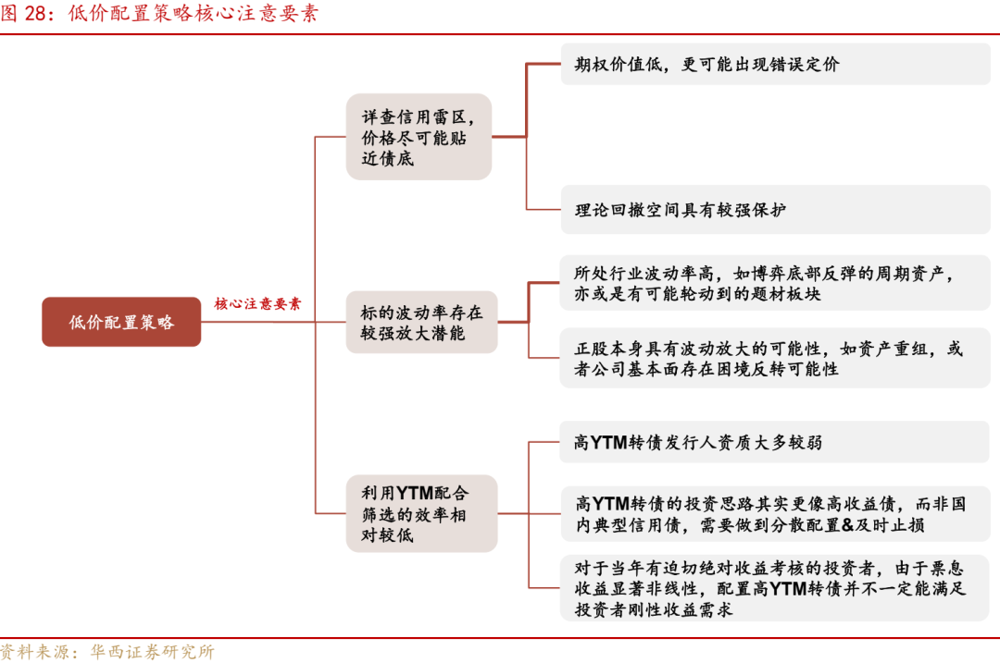

最后，我们也尝试对纯债底仓和低价配置策略进行了回测，量化结果基本佐证了这两个经典策略为何长久不衰。我们对2017年以来转债市场中的纯债底仓及低价配置策略效果进行了量化回测，细节条件如下表。从结果来看，纯债底仓策略大体可以跟上转债指数的β行情，稳定性较强。低价配置策略则将转债品种的优势充分发挥，超额收益较为可观且回撤压力可控。
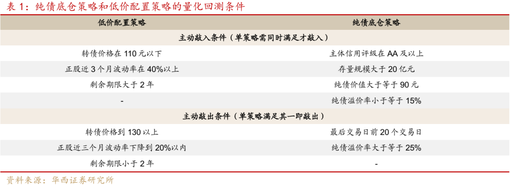
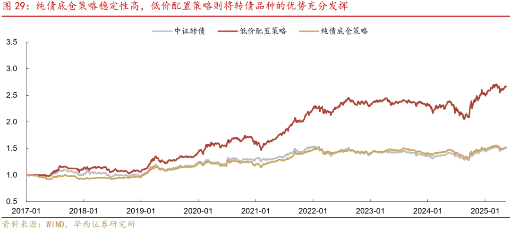

>风险提示：全球经济下行超预期。若权益市场风格加速轮动，偏股型转债估值可能受到大幅影响。若转债市场规则出现超预期调整，转债市场整体规模或者活跃度可能受到影响。若海外通胀长时间难以缓解，美联储可能加速紧缩，抑制全球市场需求。

---

> 作者: Mavelsate  
> URL: https://blog.yeliya.site/posts/%E5%8F%AF%E8%BD%AC%E5%80%BA%E6%95%99%E7%A8%8B/  

