# 废物利用篇之玩客云刷One-KVM

## **我需要转发画面**
我一个朋友在北京的传媒公司上班，知道我开了江苏电信的itv以后，拜托了我一件事——*帮忙监测电信itv对他们公司影视作品的投放情况。*

也就是说，我每天要每天打开itv，拍一些照片，记录一下然后发给他。

我的itv本来是在盒子里的，这样每天拍照我就需要打开电视，打开盒子。后来电信出了个业务，就是```itv app```，这是一个软件，可以运行在安卓电视或者投影上，用户省掉了一个盒子，节约了一个遥控器。我想了下便申请了这个业务，通过一些破解手段把这个app装到了平板上，这样我只要截图就行了，但是问题还是存在：

- 平板无法携带出门，因为itv是绑定宽带账号的，这意味着我一旦旅游就无法截图。
- 如果我把平板放在家里，缺点安卓的远程控制还不完善，而且还有各种限制。
- 我用了最复杂的一招，开了一台X86虚拟机跑安卓TV镜像，虚拟机通过noVNC访问，但是itv在X86平台上运行很麻烦，镜像缺失arm运行库，动不动就黑屏死机，用起来基本就是受罪。安卓TV镜像参考下面链接：



最后我打算买ipkvm设备来使用了，但是在选择的过程中我无意间在咸鱼上看到有刷成ipkvm的玩客云在卖，感觉世界一下子宽广了，我家里有两个玩客云啊。

>说到这两个玩客云就都是泪，我是原价买的，有大佬2000收购我都没卖，后来七七八八弄了点链克算是回本了。

玩客云刷机教程就不赘述了，要注意玩客云有两个版本，分别对应了两种短接方法。我这里直接引用网络刷机教程吧：


如果没有双头公头的USB线，可以临时用一端是A口，一端是C口的USB线凑合一下，前提是电脑有typeC口，并且线材支持传输数据，不是单纯的充电线。C口插电脑，A口插玩客云。


## **1 什么是 One-KVM？**


用过远程桌面的朋友都知道，一旦遇到 **系统崩溃、蓝屏、卡死**，甚至只是 **重装系统、进 BIOS 调设置**——远程连接直接断开，只能干瞪眼。

**One-KVM** 就是为解决这个痛点而生。它基于 PiKVM 二次开发，通过 **玩客云** 等廉价硬件实现 **视频信号采集 + 键鼠模拟 + 虚拟 USB**，达到与商用 IP-KVM 相同的效果，但成本只要几十块。

> 核心优势：**完全不依赖目标主机的操作系统**，无论系统处于何种状态，都能看到真实画面并直接操控。

简单说：**One-KVM 让远程控制从"软件层"下沉到"硬件层"，真正做到随时随地掌控主机。**

## **2 准备阶段**

在开始刷机操作之前，需要准备以下硬件设备和软件工具：

1. **玩客云盒子** x 1 
2. **电源适配器** × 1（12V/1.5A）
3. **网线** × 1（千兆或百兆均可，用于连接路由器）
4. **USB公对公数据线 x 1** 
5. **起子、吹风机、镊子** x 1（用于拆机，拧螺丝，短接触点等）
6. 本教程所需资源（**One-KVM_by-SilentWind_Onecloud_250930.burn.img**镜像，**Amlogic USB Burning Tool v2.2.0**刷写工具）

**123云盘永久链接：**[玩客云-One-KVM系统镜像资源及软件_123云盘免登录下载不限速](https://www.123865.com/s/3jOKVv-TeNzH%3Fpwd%3D1314%23) 提取码：1314

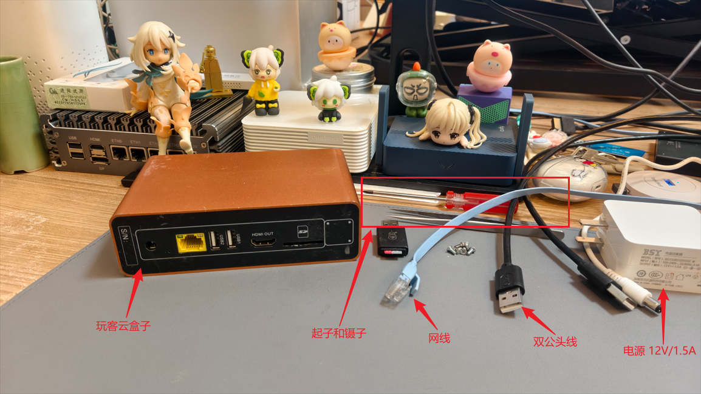

## **3 开始刷机**

### **3.1 拆机寻找短接触点**

首先，将云盘中的应用程序**Amlogic USB Burning Tool v2.2.0**安装至电脑上，安装完成会弹出驱动安装，一并安装好，然后一边备用。接着拿出你的**玩客云盒子**，用**吹风机**加热一下带许多接口的这一面，然后从**SD卡的缝隙撬开**即可：

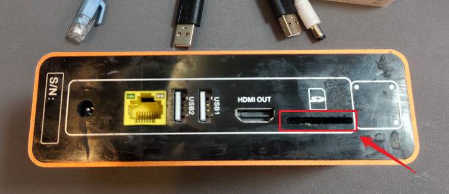

撬开以后，将6个螺丝拧下来，继续从SD卡的位置撬开：

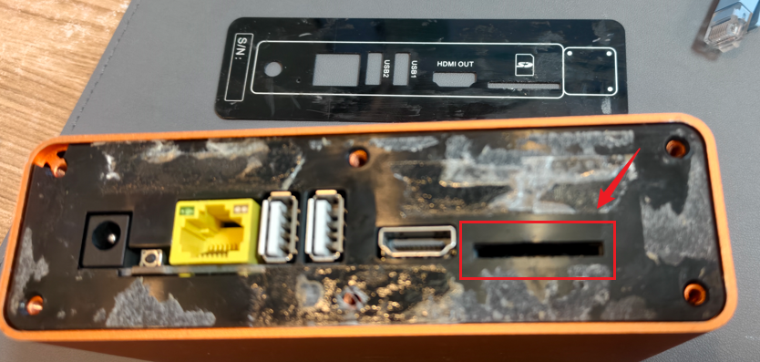

然后就可以把主板抽出来了，如下图：

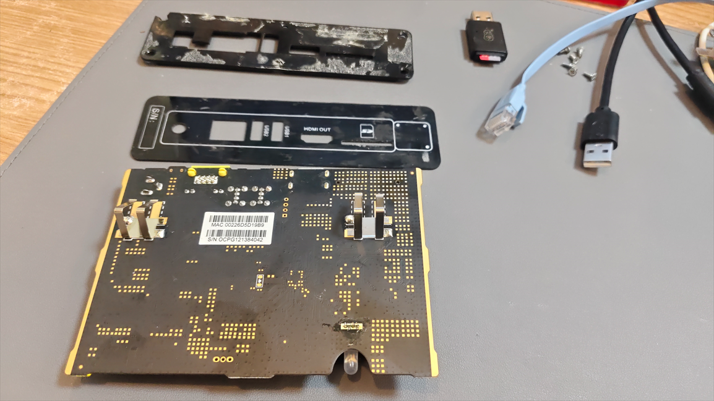

接着，我们需要找到短接的触点，当前盒子的短接触点位置为：

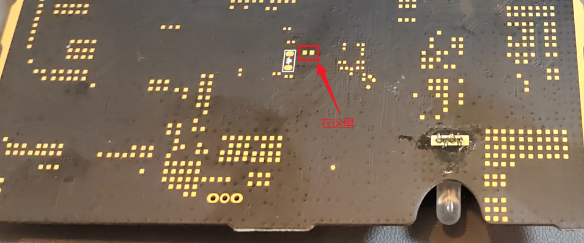

可以以这个状态指示灯为参照物，找到这两个短接触点。

### **3.2 开始刷入**

找到短接触点后，接着打开前面安装好的刷写工具**USB_Burning_Tool**，打开后，点击左上角的文件\>导入烧录包：

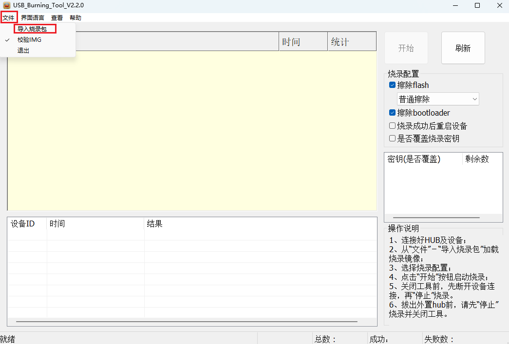

选择云盘中的One-KVM镜像（**One-KVM_by-SilentWind_Onecloud_250930.burn.img**）进行导入，等待烧录固件校验，校验完成后即可看到左下角的导入路径：

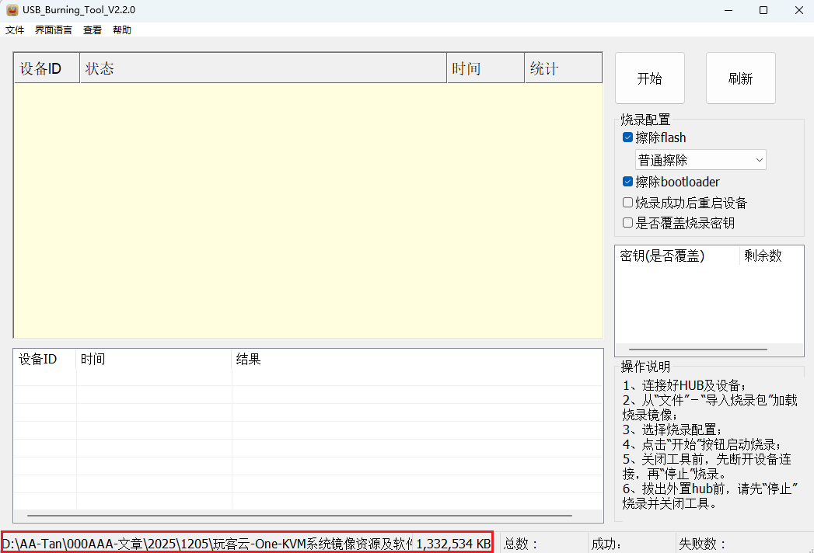

接着，将USB公对公数据线插入玩客云靠近HDMI位置的USB口，另一头插入电脑的USB口中，然后用镊子短接主板上前面找到的短接触点，最后插上电源：

1. **USB公对公数据线连接玩客云主板和电脑**
2. **镊子短接主板上的触点不要松开**
3. **将电源插入主板（等待刷写工具提示）**

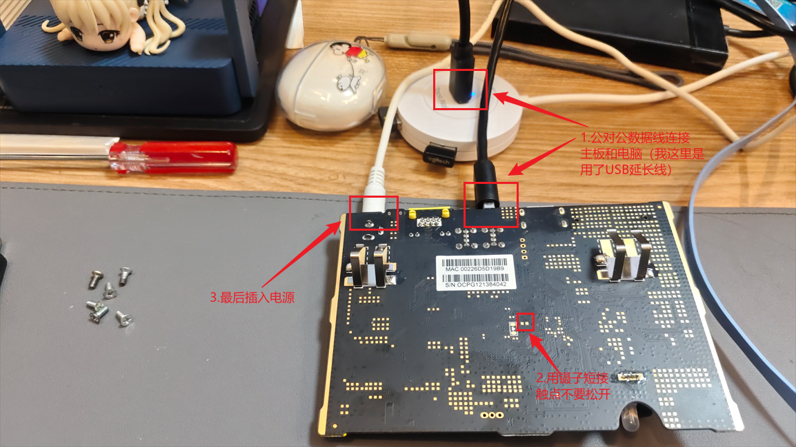

等待刷写软件出现**连接成功**提示即可松开短接触点了：

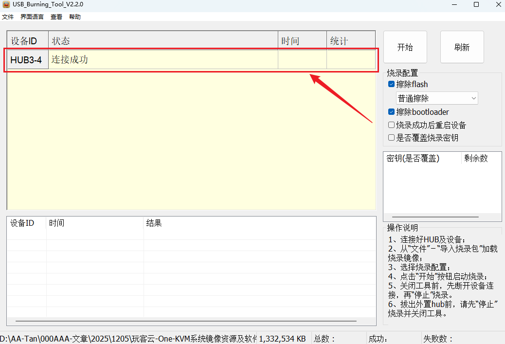

接着点击右上角的**开始**按钮，等待系统刷写即可：

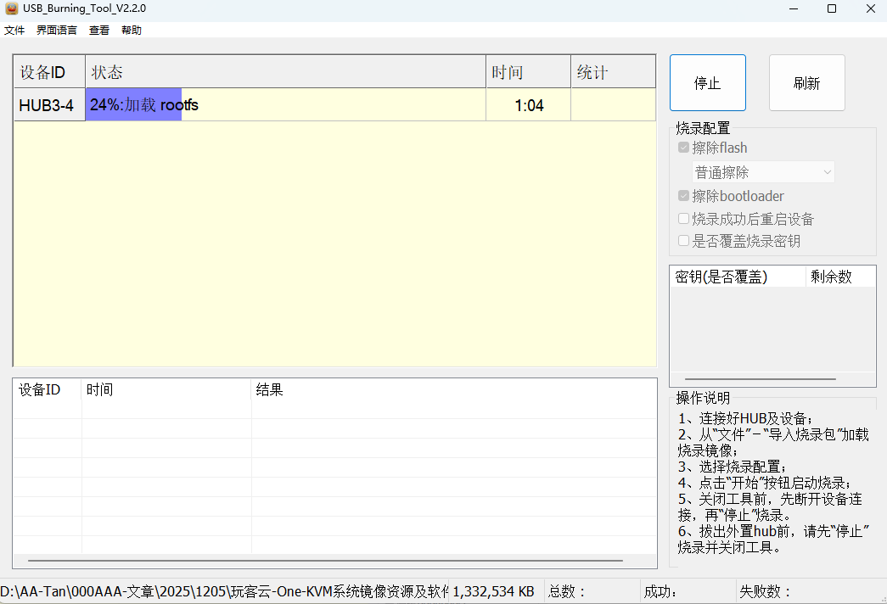

烧录完成如下：

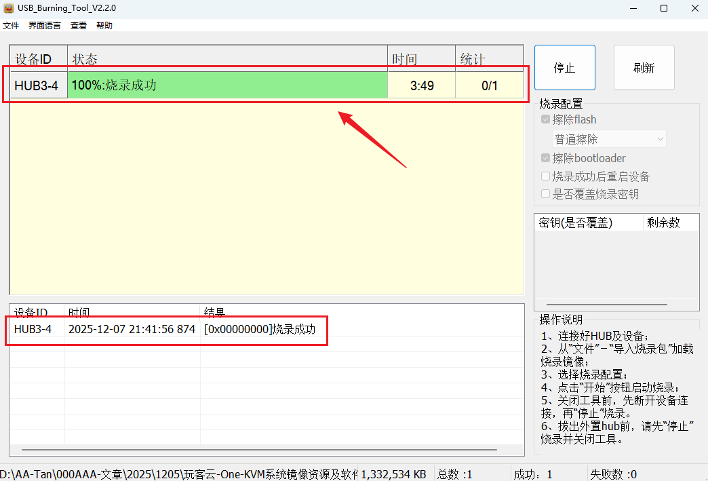

### **3.3 登录One-KVM后台**

刷入完成后，**拔掉USB公对公数据线和电源线**，然后插入**网线**，**重新插入电源**：

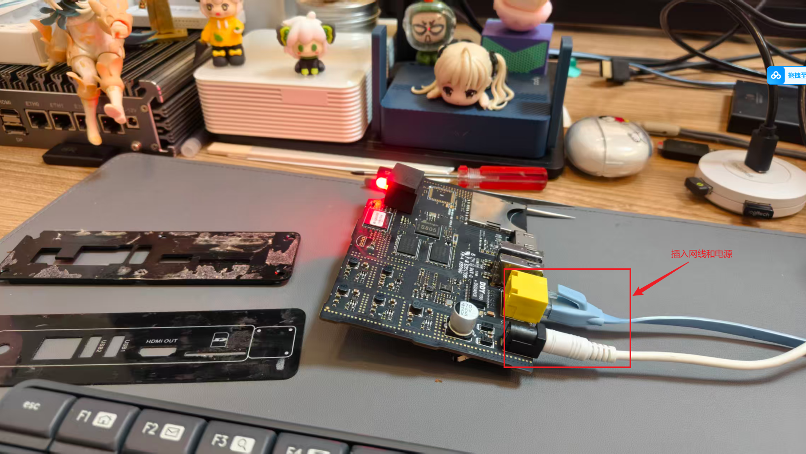

等待1\~2分钟，进入路由器后台查看hinas的IP地址，或者使用相关的局域网扫描工具（如：**Advanced IP Scanner**）：

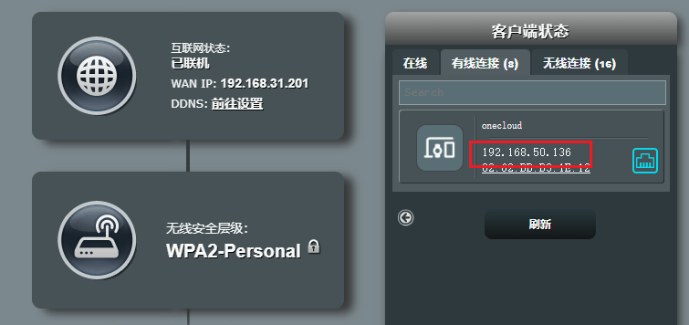

可以看到名为onecloud的设备已经出现了，访问路由器给onecloud分配的IP地址：

```
https://192.168.50.136
```


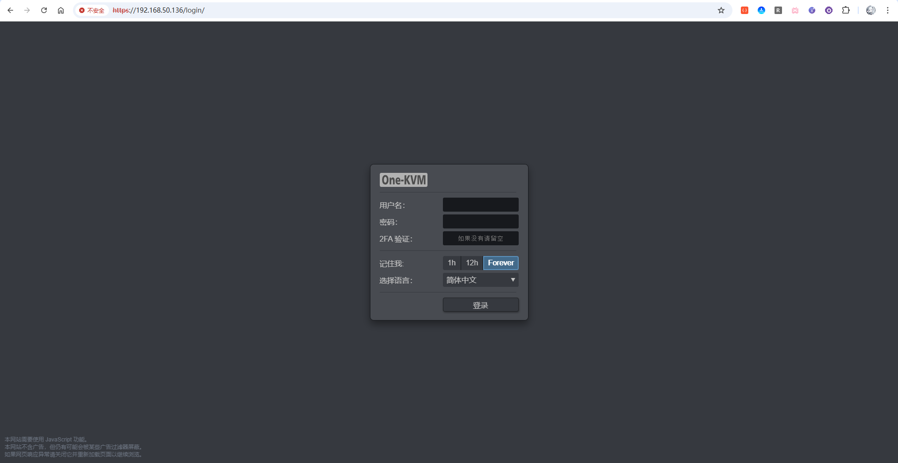

可以看到，成功访问到One-KVM啦！输入用户名和密码**admin**，登录一下即可进入到主页：

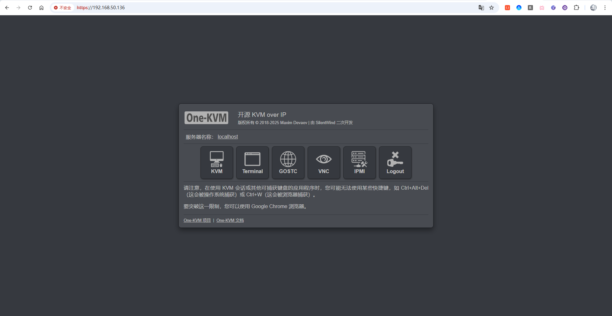


## **设置穿透和挂载SD卡**
穿透方案有很多，但是因为玩客云的Soc太老，对加密流量没有指令集处理，导致诸如TailScale这种穿透太占资源，综合下来，我选择了FRP这个穿透方案。
在玩客云（ARM32 架构）上部署 frpc（客户端），并与我的8845hs联动的完整实操步骤：(读者可以使用有公网IP的VPS，配置方式相同)

第一步：在8845HS开启 FRP 服务端
SSH 登录
```Bash
cd /opt
# 下载 amd64 版本的 frp
wget https://github.com/fatedier/frp/releases/download/v0.54.0/frp_0.54.0_linux_amd64.tar.gz

# 解压并重命名
tar -zxvf frp_0.54.0_linux_amd64.tar.gz
mv frp_0.54.0_linux_amd64 frps
cd frps

# 删掉客户端文件，保持干净
rm frpc frpc.toml
```
编辑服务端配置文件：

```Bash
nano frps.toml
填入最基础的配置：

Ini, TOML
# FRP 服务端监听端口
bindPort = 7000

# 认证 Token（跟玩客云那边保持一致）
auth.method = "token"
auth.token = "123456" 
```
保存并退出。然后先手动跑一下看看有没有报错：```./frps -c ./frps.toml```。（没报错就 Ctrl+C 停掉，想做开机自启的话，参照下面的```fprc```的```systemd``` 的写法，把路径改成 ```frps``` 即可）。
记下几个关键参数：

服务端口： 默认通常是 7000。

```Token```（密钥）： 随便设置一个复杂的字符串（比如 123456），防止别人蹭你的 FRP。
确保你的路由器已经把这个服务端口（比如 7000）转发到了 8845HS 上，或者本身就是暴露在公网的。

第二步：在玩客云上下载 FRP 客户端
SSH 登录异地的玩客云，由于它是 32 位的（```armv7```），我们需要下载 ```linux_arm``` 版本（注意不是 ```arm64```）。新版 ```FRP``` 默认使用 ```.toml``` 配置文件：

```Bash
cd /opt
# 下载 FRP (以 0.54.0 版本为例，极其稳定)
wget https://github.com/fatedier/frp/releases/download/v0.54.0/frp_0.54.0_linux_arm.tar.gz

# 解压并重命名文件夹方便管理
tar -zxvf frp_0.54.0_linux_arm.tar.gz
mv frp_0.54.0_linux_arm frpc
cd frpc

# 删掉不需要的服务端文件，保持系统干净
rm frps frps.toml
```
第三步：配置 ```frpc.toml```

我们要把玩客云本地的 ```PiKVM``` 端口（HTTPS 的 443 端口）打通到家里的 8845HS 上。

```Bash
nano frpc.toml
```
清空里面的内容，粘贴以下配置并修改为你自己的信息：
```toml
Ini, TOML
# 填入公网 IP 或域名 
serverAddr = "你的公网IP或域名"
# 填入 Lucky 里设置的 FRP 服务端端口
serverPort = 7000

# 认证 Token
auth.method = "token"
auth.token = "你设置的Token"

[[proxies]]
name = "pikvm_web"
type = "tcp"
# 玩客云本地的 IP 和 PiKVM 默认的 HTTPS 端口
localIP = "127.0.0.1"
localPort = 443
# 映射到 8845HS 上的远程端口（选一个没被占用的，比如 10443）
remotePort = 10443
```
保存并退出 (```Ctrl+O```，回车，```Ctrl+X```)。

可以先手动运行一下测试是否连通了你家：
```./frpc -c ./frpc.toml```
如果看到``` [pikvm_web] start proxy success```，说明隧道打通了！按``` Ctrl+C``` 停掉，我们来做开机自启。

第四步：把 ```frpc``` 设置为系统服务 (开机自启,```frps```参考执行)
因为玩客云要在异地无人值守，开机自启和崩溃重启非常重要。

```Bash
nano /etc/systemd/system/frpc.service
```
粘贴进去：
```toml
Ini, TOML
[Unit]
Description=Frp Client Service
After=network.target

[Service]
Type=simple
User=root
Restart=on-failure
RestartSec=5s
ExecStart=/opt/frpc/frpc -c /opt/frpc/frpc.toml

[Install]
WantedBy=multi-user.target
```
保存后，启动并设置自启：

```Bash
systemctl daemon-reload
systemctl enable frpc
systemctl start frpc
```
### 挂载SD卡
这个纯粹是我有个4G的垃圾SD卡不知道干嘛用了，**玩客云的SD卡槽协议过于老旧**，新协议的64G的SD卡不能识别，要么用卡套转接tf卡，要么用老卡。
还好我有个老卡，正好用来放截图。
挂载SD卡需要经过**识别设备**、**分区格式化（如果还没做）**、**创建挂载点**和**写入自动挂载**这几个步骤。
- 识别设备
  首先需要查看系统是否分配了设备节点。在终端输入：
  ```Bash
    lsblk
  ```
     - 玩客云内置的 eMMC 通常是 `/dev/mmcblk0`。
     - 插上的 SD 卡通常显示为  `/dev/mmcblk1`。
     - 如果卡上有分区，你会看到 `/dev/mmcblk1p1`。

- 分区格式化
  ```bash
  # 格式化为 ext4 格式
  mkfs.ext4 /dev/mmcblk1p1
  ```

- 手动挂载测试
  
    创建一个文件夹作为挂载点（例如叫 `storage`），并尝试挂载：
    ```
    mkdir -p /mnt/storage
    mount /dev/mmcblk1p1 /mnt/storage
    ```

    检查是否成功：

    ```Bash
    df -h
    ```

    看到 `/mnt/storage` 对应了你的 SD 卡容量，说明手动挂载成功。
- 自动挂载
  
    玩客云重启后，手动挂载会失效。我们需要修改 `/etc/fstab`。

    为了稳定，建议使用 **UUID** 挂载。先获取 SD 卡的 UUID：
    ```
    blkid /dev/mmcblk1p1
    ```

    会看到类似 `UUID="550e8400-e29b-..."` 的字符串。

    编辑配置文件：
    ```
    nano /etc/fstab
    ```
    在文件末尾添加一行（将 UUID 替换为你实际查到的）：
    ```
    UUID=你的UUID  /mnt/storage  ext4  defaults,noatime  0  2
    ```

  `noatime`: 减少对 SD 卡的读取次数，延长寿命。
  `0 2`: 允许系统自检。

  **测试配置是否正确：**

  ```
  umount /mnt/storage
  systemctl daemon-reload
  mount -a
  ```

  如果没有报错，下次你重启玩客云，SD 卡就会自动出现在 `/mnt/storage` 了。

---

> 作者: Mavelsate  
> URL: https://blog.yeliya.site/posts/%E5%BA%9F%E7%89%A9%E5%88%A9%E7%94%A8%E7%AF%87%E4%B9%8B%E7%8E%A9%E5%AE%A2%E4%BA%91%E5%88%B7one-kvm/  

