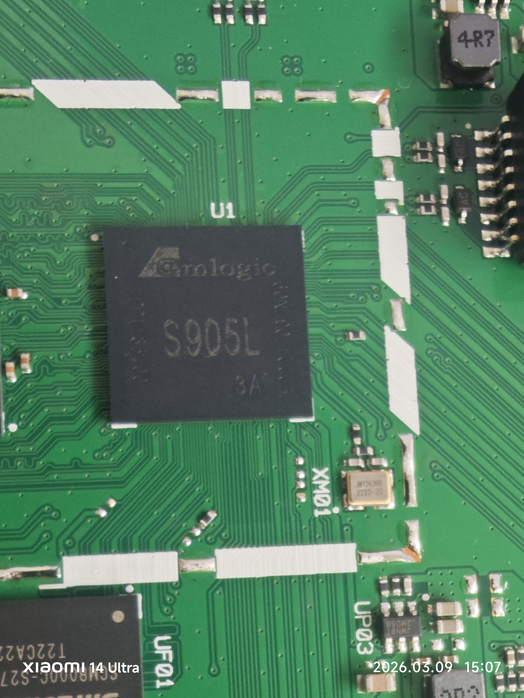
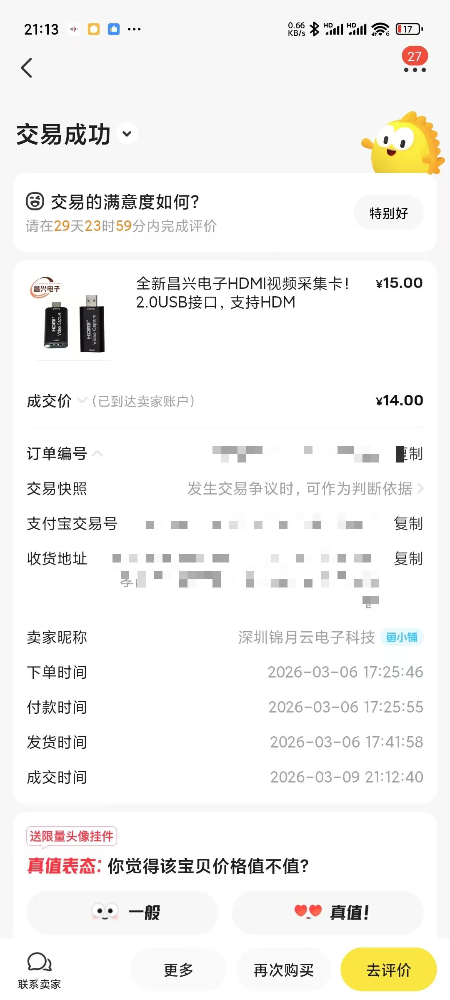
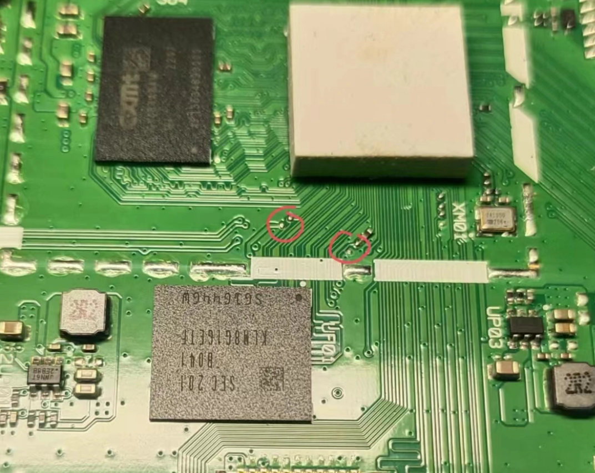
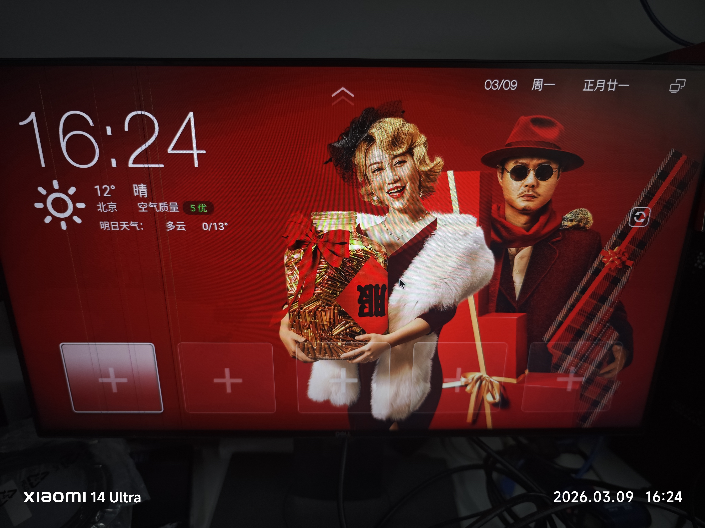
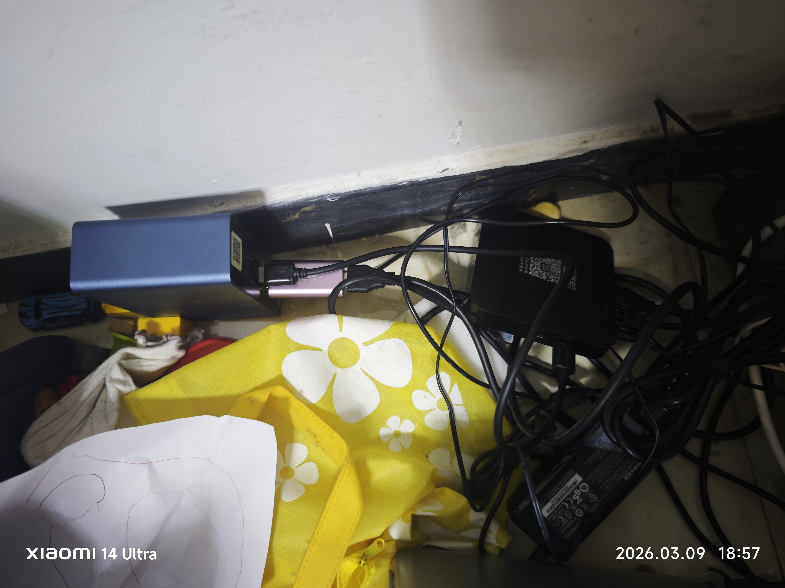
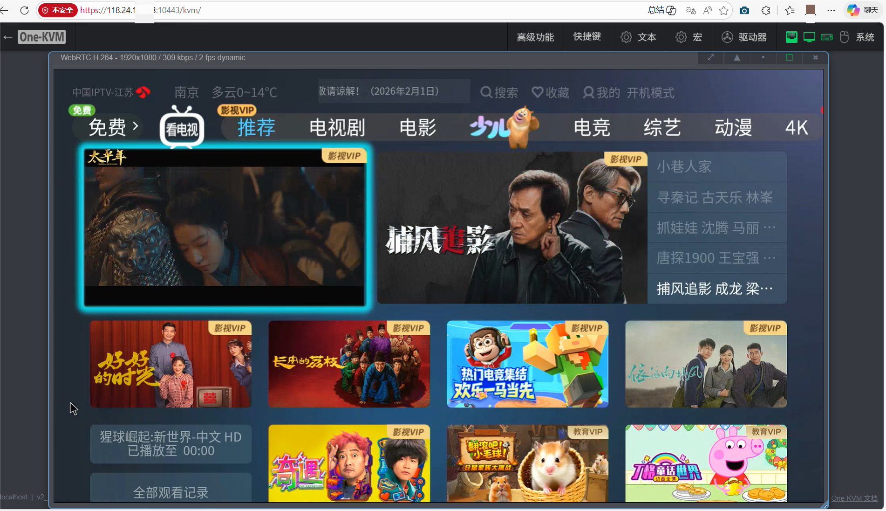

# 废物利用篇之魔百盒刷机装itv

## 书接上文,确定信号源方案
在[上篇文档]()里，我做好了KVM的搭建，现在开始弄信号源，也就是itv的播放。

但是现在有个问题，我的itv是跑在投影里的，投影没有输出，于是我把视线投到了电信送的这个盒子上。现在我面临两个选择：
  - 1 打电话给电信，把itv app业务取消，重新回到盒子的使用方式。
  - 2 把电信盒子破解掉，刷机刷成安卓tv的系统，再安装itvapp，通过这种方式输出信号。
  
  方案1最方便，但是据说电信不会给转回去，就算转回去，还要收上门费100，还要约上门时间，我等不及了。

  方案2的缺点就是itv app会占用带宽，但是我的电信宽带几乎没人用，占了就占了吧。

于是我开始寻找刷机的方案。推荐下面这个网站



我的机顶盒型号是创维E900V22D，按照论坛教程，这个型号的Soc有很多种，需要拆机判断。于是我先拆机，看到了我的soc是```S905L-3A```，算是比较好刷的SOC。这点还是很幸运的。


## 采购采集卡
前两天我在小黄鱼下单斥重金15元买了一块采集卡，今天收到了。


**我没有买短接头**，我觉得不需要，因为我不会经常刷机，而且短接头也要七八块钱，只用一次的东西，算起来贵的要死，还是自己短接主板吧，省一点是一点。

对于非特殊需要来说，USB2.0+1080P@60Hz足够了，参数没必要太高。

## 刷机
刷机和刷玩客云差不多，毕竟两者都是晶晨的Soc，刷机软件都一样。步骤也差不多。

事前准备：把USB公头插在靠电源的USB口上，另一个公头虚插在电脑USB口上，不要插进去，盒子主板接电源但是电源开关关闭。刷机软件装载固件，并点击开始。

- 1 先短接触点。```S905L-3A```有两个短接方案，都可以。


这里的两个红圈里，短接任意一个红圈的两个触点即可。

- 2 一只手保持短接，另一只手把USB线另一个公头插入电脑USB口，然后按下主板电源键。


- 3 等到刷机软件出现写入uboot的时候，也就是进度条是3%的时候，松开短接线。
- 4 刷机完成后，先点退出，然后拔掉USB线，再关闭电源。
- 5 刷机完成，享受吧。


## KVM和盒子连接
把采集卡插到玩客云**网口附近** 的USB口，接上hdmi线，双公头USB线插**玩客云hdmi接口旁边**的USB口，因为这个口支持**OTG**,这里起到传递鼠标键盘信号的作用。

组装在一起看起来好乱，后面再整理吧。打算用3D打印一个收纳柜。

## 成果展示
结合上一篇的[KVM穿透]()，现在我可以在公网给ITV APP截图了，后续做一个自动截图的脚本，定时截图直接发给我朋友。不过这个排期比较久远了，因为接下来我要折腾软路由了。



---

> 作者: Mavelsate  
> URL: https://blog.yeliya.site/posts/%E5%BA%9F%E7%89%A9%E5%88%A9%E7%94%A8%E7%AF%87%E4%B9%8B%E9%AD%94%E7%99%BE%E7%9B%92%E5%88%B7%E6%9C%BA%E8%A3%85itv/  

