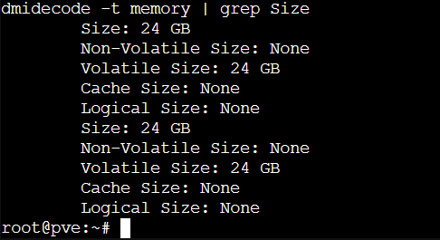
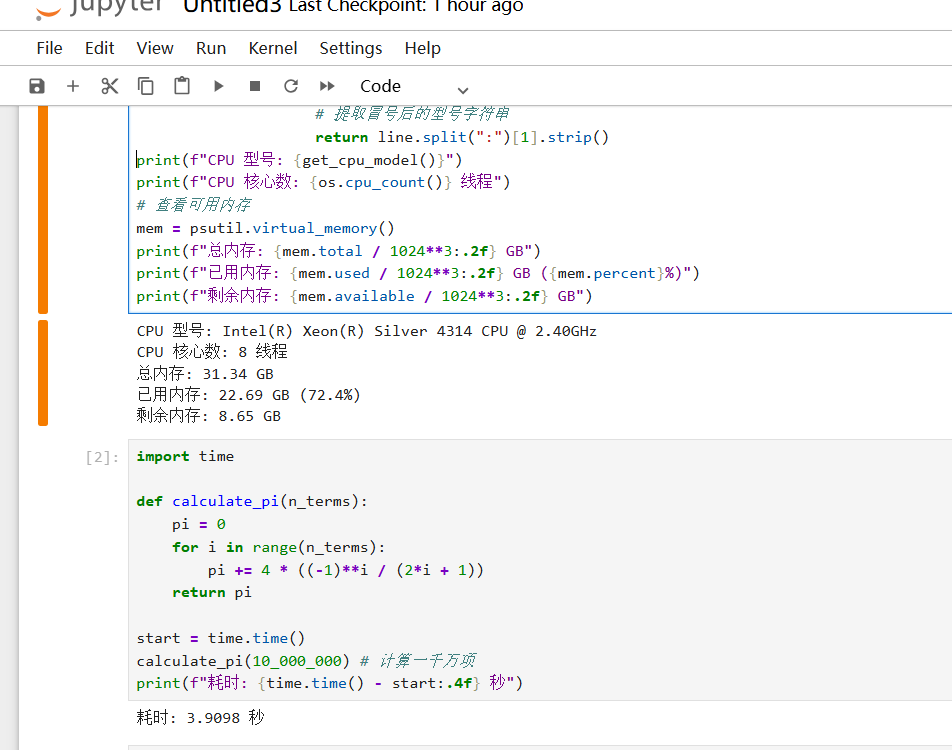

# Jupyter服务器更新了，小玩具绽放第二春


## 为什么要再次折腾Jupyter

### 我有一台闲置的主机
我有一台火影A8的8845HS小主机，双网口，双NVME位，配了48G(24G+24G)内存，当时好奇这种非二进制的内存条，说是AMD专用，但是配好以后因为我不缺电脑，所以这个电脑做什么我一直没想好，几乎闲置，卖钱的话，老婆在笑话我炒股亏这么多了么，都要变卖家产了。不卖钱就只好用起来了。当过steam串流的主机，可是我又没时间玩游戏。

正好我现在的宽带提供了公网IPv4，之前是把飞牛小主机在路由器上做了DMZ，把它完全暴露在公网，现在想想还是不要这么奢侈了，8845的小主机也要联网用起来，尤其是现在内存暴涨的时代，48G内存闲置简直是犯罪。现在超级后悔当时怎么不上48+48的96G内存。😂


### 宽带有公网IPV4+IPV6
我的家宽网络还是相当不错的，提供的公网IPV4+IPV6,几乎媲美大的ISP商。我知道单IPV6也能做DDNS，但是我有IPV4情节。


### 下定决心再次折腾
思忖再三，那么就做个PVE，有需要就开虚机All in one呗，后来想着那就搭个jupyter吧，方便我调策略，回测数据。

## 开始折腾

### 如果虚机是linux的话，建议使用CT，除非对内核有特殊要求。
PVE很好装，装的是最新的9.1.4。

装完就下载CT模板，因为都是linux，lxc模板要比vm虚机更实用，损耗更小，几乎无感，而且资源都是动态分配的，非常适合AIO。
建议改源，不改也没问题，源的速度还行，下载135M的ubuntu镜像花了12分钟，用清华源估计几分钟，但是影响不大。不像[docker仓库必须要改]()。

新建CT，分配资源什么的就不记录了。

我给Jupyter容器分了8核+24G内存。

### 接下来就是在模板里面装jupyter。

这个也很简单。

- 第一步进入容器的控制台(SSH连过去也行)。
 
  ```Bash
  # 更新系统并安装 Python 环境
  apt update && apt upgrade -y
  apt install python3-pip python3-venv -y
  ```
- 第二步：安装 Jupyter Lab
  
  在 /opt 下创建一个虚拟环境，使用虚拟环境是个好习惯：

  ```Bash
  # 创建并进入工作目录
  mkdir -p /opt/jupyterlab && cd /opt/jupyterlab
  # 创建虚拟环境
  python3 -m venv venv
  # 激活环境
  source venv/bin/activate
  # 安装主角
  pip install jupyterlab
  ```
- 第三步：配置密码或者token，我选择的是密码
  
  设置密码，并让它允许在局域网内被访问：

  设置密码：

  ```Bash
  jupyter lab password
  # 按照提示输入两次你想设置的密码
  生成并修改配置：
  jupyter lab --generate-config
  # 允许远程访问（直接用命令修改）
  echo "c.ServerApp.ip = '0.0.0.0'" >> /root/.jupyter/jupyter_lab_config.py
  ```
- 第四步：如果不想每次都手动输入命令启动，需要把它写成系统服务：

  创建一个服务文件：

  ```Bash
  nano /etc/systemd/system/jupyter.service
  ```
  粘贴以下内容：
  ```toml
  Ini, TOML
  [Unit]
  Description=Jupyter Lab
  After=network.target

  [Service]
  ype=simple
  User=root
  WorkingDirectory=/opt/jupyterlab
  ExecStart=/opt/jupyterlab/venv/bin/jupyter-lab --allow-root --no-browser --ip=0.0.0.0
  Restart=always

  [Install]
  WantedBy=multi-user.target
  ```
  保存并退出 (Ctrl+O, Enter, Ctrl+X)，然后输入：

  ```Bash
  systemctl enable --now jupyter
  ```
- 第五步：启动
  输入以下命令开启jupyter：

  ```Bash
  # 启动 Jupyter Lab（--allow-root 是因为我们在 LXC 容器内）
  jupyter lab --allow-root --no-browser
  ```
### 访问
在浏览器地址栏输入： http://[刚才你设的容器IP]:8888，*如果是采用token方式的话，要把上面命令输出的http://[刚才你设的容器IP]:8888&token=XXXX这一串都复制粘贴到地址栏进行访问。*

## AMD,YES！
结果很震撼。

8845的8核居然比4314的8核要强。
8845计算一千万pi值要比4314的8核快2.3秒,差距一倍了。

这可是小主机的CPU和服务器CPU对比啊。

不得不感叹，

**AMD,YES！**




## 接下来的计划

本来想把飞牛做个NFS，让jupyter容器挂载的，后来想了下，小主机自己就有4T的空间，没这个必要。

后面我想的是再开一个CT模板跑lucky，把我的小主机和飞牛反代出去，然后用Tailscale把我那几台在公司没有公网IP的机器连起来。干脆博客就在这个小主机上运行算了，做个动态解析，也别用GitHub了，阿里和腾讯的ESA反正也是免费，然后把我所有服务挂到二级域名下面。毕竟lucky申请泛解析的证书很方便。

大工程啊。🙄


---

> 作者: Mavelsate  
> URL: https://blog.yeliya.site/posts/%E6%96%B0jupyter%E6%9C%8D%E5%8A%A1%E5%99%A8%E4%B8%8A%E7%BA%BF/  

