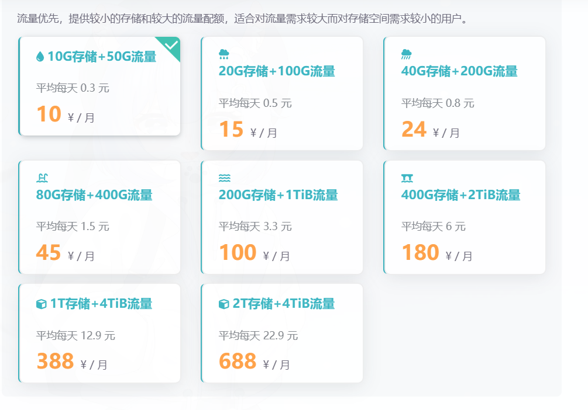
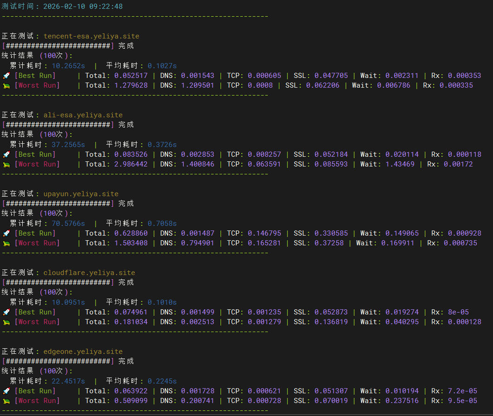

# 网站搬家咯

## OSS各家总体评价
&nbsp;&nbsp;&nbsp;&nbsp;&nbsp;&nbsp;&nbsp;&nbsp;**又拍云**是个好平台，挂了又拍云的aff能够享受10G存储+15G流量，而且只收流量减去存储的钱，比较绕，可以不用理会，因为大部分人都是流量远远小于存储，不限回源和点击，基本上算是性价比天花板了。
我体验了其他几家的OSS。都不如又拍云。
- **腾讯云**和**阿里云**：两家目前只有免费体验期，*腾讯云8年前有50G存储+10G流量+200万次免费点击的终身免费包*，但是我没拿到😭，*这两家可以利用内网流量免费的特点，买一个低价VPS接入OSS，通过VPS读写OSS绕过0SS公网流量计费，不过注意细节，这个以后再说*。
- **[多吉云](https://www.dogecloud.com/?iuid=14477)**：给的很大方，**永久免费10G存储**，每个月的免费资源为**视频云流量包20G，视频云空间免费额度	20.00 GB，免费视频云转码资源包额度2858 分钟，融合 CDN 流量包20G，HTTPS请求数200万次。**

      缺点也很明显，主要是那10G的免费存储使用上：
    
      基础型：仅支持在控制台上传文件，使用加速域名访问、下载文件。*不支持* 使用 SDK 访问，不支持图片处理、镜像存储、生命周期等高级功能。

      标准型：支持完整高级功能，支持使用 SDK 上传下载，不支持每月10GB 的免费存储额度。
   不过价格不贵，一年100G云存储包是93块钱，配合免费的CDN和https点击数用着也很舒服。这是官网[多吉云](https://www.dogecloud.com/?iuid=14477)想注册可以点[这里](https://console.dogecloud.com/register.html?iuid=14477)。邀请码：14477。
- **七牛云**：老牌免费厂商了，值得一试，早早年它就是广大独立博主的图床首选，导致现在很多APP或者网站会给七牛云单独做个API接口。唯一缺点就是*免费包不支持https*
- **青云**：*只支持企业客户，免费的20G存储+10G流量，你要是有个体户身份可以去试试*。
- **网易云**：*跑路了*。
- **滨纷云**：很大方，页面很西方化，和国内云服务商界面完全不同，有兴趣可以去看看，流量给的很足，**50G存储+30G流量**（*S4流量10G+CDN出口10G+回源10G且每项每日限5G*）+30万次点击（*10万次S4+10万次回源S4+10万次CDN请求且每日每项限 1 万次*）

  &nbsp;&nbsp;&nbsp;&nbsp;&nbsp;&nbsp;&nbsp;&nbsp;但是这个站吧，一股草台班子味，实名认证形如虚设。遗憾的是不支持静态部署，只能当图床了。目前要求最低充值10元才能用OSS，充值20元以上有返利。
  
  
- [雨云](https://www.rainyun.com/OTg5Njc4_)：浓浓的死宅味道，不喜欢的要说一句showshowway,喜欢的估计爱的要死。可以签到挣钱，看看这个界面。你要是想用，记得填我的优惠码:```OTg5Njc4``` 我能挣1块钱（笑）。给你看看它的二次元味道重不重


  &nbsp;&nbsp;&nbsp;&nbsp;&nbsp;&nbsp;&nbsp;价格方面中规中矩，好处是有**小规模的套餐包**，最低年付**7折**，84一年。不像其他大厂，起步就是200G,500G。用不完也是浪费，按量付费又担心一夜之间房子被拍卖了。具体价格看下图：

## 目光转向ESA
&nbsp;&nbsp;&nbsp;&nbsp;&nbsp;&nbsp;&nbsp;国内目前做ESA的主要就是*腾讯*和*阿里*，国外就是大名鼎鼎的赛博善人*cloudflare*了，基本上*阿里*和*腾讯*的ESA就是对标*cloudflare*，如果你的域名没有备案，可以去海外站使用。
### 技术选择
&nbsp;&nbsp;&nbsp;&nbsp;&nbsp;&nbsp;&nbsp;那么就目前来说，ESA和OSS+CDN仅就静态部署来说，谁更合适呢？
其实是ESA更合适，主要是：
- OSS+CDN实现的静态部署只是附加功能，它没有版本控制，不能实现测试和生产分离，无法做到精准访问限制，边缘函数功能弱等一系列不足。
- ESA实现的静态部署只是一个很低级的应用，配合各种框架，其实实现的是webAPP的功能，配合PWA或者边缘函数，可玩性非常高，静态部署只是一个很小的功能实现。
  
### 选谁呢？
&nbsp;&nbsp;&nbsp;&nbsp;&nbsp;&nbsp;&nbsp;我写了一个脚本，对cloudflare，阿里ESA（*国内*），腾讯ESA（*国内*），Edgeone（*腾讯海外ESA的独立站，非腾讯云海外站*）做了测试。脚本如下,实现对每个站点的解析、建连、握手、响应计时。每个站点统计100次，计算总用时和平均用时，并列出最好和最坏的一次用时详情，并且使用国内和国外两个IP进行测试。

- 首先，修改depoly.yml，在github执行action的时候把相同的构建产物，也就是网页文件发给要测试的五个平台。
- 做好二级域名解析。等10分钟解析生效。
- 接下来是脚本代码
  ```shell
  #!/bin/bash
  
  # ================= 配置区域 =================
  # 定义要压测的域名列表
  DOMAINS=(
      "https://tencent-esa.yeliya.site"
      "https://ali-esa.yeliya.site"
      "https://upayun.yeliya.site"
      "https://cloudflare.yeliya.site"
      "https://edgeone.yeliya.site"
  )
  # 测试次数
  COUNT=100
  # ===========================================
  
  # 颜色定义
  GREEN='\033[0;32m'
  RED='\033[0;31m'
  YELLOW='\033[1;33m'
  CYAN='\033[0;36m'
  BLUE='\033[0;34m'
  NC='\033[0m'
  
  echo -e "\n${CYAN}=== 稳定性测试 (每域名 ${COUNT} 次) ===${NC}"
  echo -e "${CYAN}测试时间: $(date "+%Y-%m-%d %H:%M:%S")${NC}"
  echo "----------------------------------------------------------------"

  # 临时文件
  TMP_FILE="/tmp/speed_stress_data.txt"

  # 格式化打印函数
  print_line_detail() {
    local label=$1
    local line_data=$2
    local color=$3
    
    echo "$line_data" | awk -v lbl="$label" -v clr="$color" -v nc="$NC" '{
        code = $1
        t_dns = $2; t_conn = $3; t_app = $4; t_start = $5; t_total = $6

        # 计算增量耗时
        d_dns = t_dns
        d_tcp = t_conn - t_dns; if(d_tcp<0) d_tcp=0
        if (t_app == 0) { d_ssl = 0; d_wait = t_start - t_conn } 
        else { d_ssl = t_app - t_conn; d_wait = t_start - t_app }
        if(d_ssl<0) d_ssl=0; if(d_wait<0) d_wait=0
        d_rx = t_total - t_start; if(d_rx<0) d_rx=0

        printf "%s%-16s%s | Total: %-6s | DNS: %-6s | TCP: %-6s | SSL: %-6s | Wait: %-6s | Rx: %-6s\n", 
            clr, lbl, nc, 
            t_total, d_dns, d_tcp, d_ssl, d_wait, d_rx
    }'
  }

  for url in "${DOMAINS[@]}"; do
    # 提取域名显示
    display_domain=$(echo $url | sed 's/https:\/\///')
    
    echo -e "\n正在测试: ${YELLOW}${display_domain}${NC}"
    printf "["
    
    # 清空临时文件
    > "$TMP_FILE"
    
    # === 核心循环: 跑 COUNT 次 ===
    for ((i=1; i<=COUNT; i++)); do
        # 抓取数据 (code dns tcp_connect ssl_handshake ttfb total)
        curl -o /dev/null -s -w "%{http_code} %{time_namelookup} %{time_connect} %{time_appconnect} %{time_starttransfer} %{time_total}\n" "$url" >> "$TMP_FILE"
        
        # 进度条效果
        if (( i % 2 == 0 )); then printf "#"; fi
    done
    printf "] 完成\n"

    # === 数据分析 ===
    
    # 1. 计算总耗时和平均值
    total_stats=$(awk '{sum+=$6} END {printf "%.4f %.4f", sum, sum/NR}' "$TMP_FILE")
    read sum_time avg_time <<< "$total_stats"
    
    # 2. 找出最好(Min Total) 和 最坏(Max Total) 的行
    # sort -k6 -n 表示按第6列(Total)数字升序排列
    best_line=$(sort -k6 -n "$TMP_FILE" | head -n 1)
    worst_line=$(sort -k6 -n "$TMP_FILE" | tail -n 1)
    
    # === 输出结果 ===
    echo -e "统计结果 (${COUNT}次):"
    echo -e "  累计耗时: ${BLUE}${sum_time}s${NC}  |  平均耗时: ${BLUE}${avg_time}s${NC}"
    
    # 打印最好的一行
    print_line_detail "🚀 [Best Run]" "$best_line" "$GREEN"
    
    # 打印最坏的一行
    print_line_detail "🐢 [Worst Run]" "$worst_line" "$RED"
    
    echo "----------------------------------------------------------------"
  done

  # 清理
  rm -f "$TMP_FILE"
  ```
跑出来的结果很好玩，出乎意料。
- 国内跑出来的结果如下（无梯子）：

  - 腾讯ESA国内非常快，唯一跑进<font color="#2ea44f">**0.1**</font>秒的选手，实际上在更早的测试它最好成绩是**0.06**秒，不过那时候我没有集中测试。
  - 阿里第二，记住这个第二，后面会很坑。
  - 又拍云第三，实际上和第二差距不大。
  - 让我惊讶的是edgeone怎么和cf是一个速度，之前我是跑出来过0.2秒的，是直连数据，现在怎么慢这么多。不信邪的我用curl -I测了一下，确认是edgeone独立站点，提示```server: edgeone-pages```难道CDN走了CF的节点？
  - cf没什么好说的，国内用就是减速器。
- 在美国VPS测试结果如下：（位置DC）
  
  - 腾讯ESA真的是牛逼，牛逼到根本不需要CF了，可以看到最坏的那次是被解析坑了，这是最恐怖的地方。Cloudflare 在海外是地头蛇，速度快是应该的。但腾讯 ESA 作为一个中国产品，在海外竟然跑出了和 Cloudflare 一模一样的 0.10s 平均成绩！
  
    看细节：腾讯的最好的一次成绩种TCP建连仅 <font color="#2ea44f">0.0006s</font>。这意味着这个机房旁边，必定有一个腾讯 EdgeOne 的节点。
  - 回到主场，CF 终于展现了实力。
    稳定性之王，注意它的最差只有 0.18s。相比之下，腾讯虽然平均快，但最差出现了 1.2s 的 DNS 波动。Cloudflare 在海外的 DNS 解析极其稳定，从不掉链子。
  - 又拍云没有做全球加速，或者是我的白嫖套餐不包含海外加速。在海外访问它，就是硬生生地跨洋回源，体验很差，数据非常诚实。
  - 压力来到阿里云，等待时间能到1.43s。这说明阿里的海外节点经常出现“回源拥塞”或者“冷启动”极慢的情况。方差太大，用户体验会像坐过山车。虽然它的最好能跑到 0.08s（说明有海外节点），但最坏竟然高达2.98s！和腾讯ESA一样，DNS解析也不是很稳定。
  - EdgeOne表现中游，不管你信不信，之前我测edgeone在国内也是这速度，不知道为啥今天测不出来了，而且现在从国外访问明显也不是cf的线路， 另外让我惊讶的是，它居然和腾讯ESA路线不一致，原来真的是独立运营吗？
## 总结
| 域名/厂商 | 国内耗时 | 海外耗时 | 评价 |
| :--- | :--- | :--- | :--- |
| **腾讯 ESA** | <font color="#2ea44f">**0.08s**</font> (极速)  | <font color="#2ea44f">**0.10s**</font> (极速)  | <font color="#2ea44f">**通杀全球，唯一真神**</font> |
| **Cloudflare** | 0.62s (龟速)  | <font color="#2ea44f">**0.10s**</font> (极速)  | 偏科严重，国内不可用 |
| **EdgeOne AI** | 0.62s (绕路) | 0.22s (流畅) | 表现尚可，应用层有损耗 |
| **阿里 ESA** | 0.10s (极速) | 0.37s (抖动)  | 出了国就不稳了 |
| **又拍云** | 0.14s (稳健) | <font color="#ec0b2d">0.70s</font> (龟速)  | 纯国产，放弃海外市场 |

**也就是说**
>[!TIP]
>如果你的静态站点部署在国内，腾讯ESA是唯一最优解。
 
开盘了，再见！
  

---

> 作者: Mavelsate  
> URL: https://blog.yeliya.site/posts/%E7%BD%91%E7%AB%99%E6%90%AC%E5%AE%B6%E5%92%AF/  

