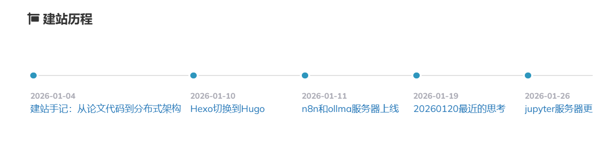
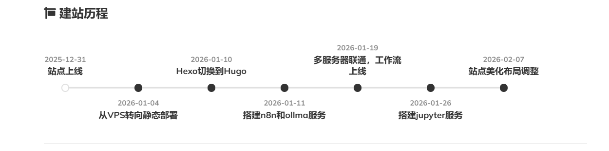

# 美化了一下站点


## 缘起
看到网上四位大佬的BLOG

\[1\].[Liu Houliang][1]

\[2\].[毕少侠.也在江湖][2]

\[3\].[字节飞鸿][3]

\[4].[吐司气泡][4]

这四位大佬的Hugo美到让我不敢相信是Hugo，尤其是第二位大神，美到让人哭，特效不要钱吗？这美化我一辈子也追不上。
不过虽然美化追不上，但是大佬们博客的功能性都独树一帜，我认真学习了四位大佬的博客布局以及思想，制定了自己博客的美化方案。

一个字：*克制*

主要是我没那个技术和审美能力，Fixit的布局结构臻于完美，没有足够的美学能力很难做加法，那简单，我做 *减法* 。

## 美化成果介绍

- *关于* 页面增加了 *站点信息统计* 和 *建站历程* 的时间轴。
  
  *本来想学**这位大神的状态页面，也加上发布周期什么的，但是一方面不知道为啥我的浏览器解析Echart非常卡，半天才加载出来，另一方面我的博客文字为主，几乎没有图形和色块阴影，突然来几个图很突兀，干脆删掉这几个功能。*
- 增加了导航页，将原先的归档、标签、分类三页合一，节省出导航栏空间，为后面的功能扩充做准备。
- 对字体，字号，字色做了微调。

### *关于* 页面制作

#### 站点信息统计制作

这个简单，写一个*shortcode*遍历整个站就行,例如遍历分类：

>[!TIP]
>*shortcode介绍见：*
>[基于Shortcodes的Hugo进阶使用——功能扩展与美观方向]()

```html
<div class="my-taxonomies">
    {{- range $name, $taxonomy := .Site.Taxonomies.categories -}}
    <a href="{{ "/categories/" | relLangURL }}{{ $name | urlize }}" class="taxonomy-card category-card">
        <span class="taxonomy-name">{{ $name }}</span>
        <span class="taxonomy-count">{{ $taxonomy.Count }}</span>
    </a>
    {{- end -}}
</div>
```
难度在更新次数上，解决办法如下:

需要修改CI构建脚本，CI 构建时通过以下脚本自动化完成：

- 第一步：在 CI 中统计并写入数字 在 hugo build 之前，在 Actions 里加一行：

```Bash
echo "{\"count\": $(git rev-list --count HEAD)}" > data/stats.json
```
- 第二步：在 FixIt 模板中调用 
```HTML
<span>本站已累计更新 {{ .Site.Data.stats.count }} 次</span>
```
原理：

Hugo 的工作机制是这样的：

它启动时会扫描 ```data/``` 文件夹。

如果看到 ```stats.json```，它会创建一个名为 ```.Site.Data.stats``` 的映射（Map）。

如果 *JSON* 里的 ```Key``` 是 ```count```，你就能直接点选出 ```count```。
#### 建站历程时间线制作
按照，以及的说法，我做了一个shortcode。
```html {title="点击查看", open=false}
{{- /* 抓取分类为“建站历程”的所有文章，按时间正序排列 */ -}}
{{- $pages := .Site.Taxonomies.categories.建站历程.Pages.ByDate -}}

<div class="site-history-wrapper">
    <div class="site-history-container">
        {{- range $pages -}}
        <div class="history-item">
            <div class="history-axis">
                <div class="history-dot"></div>
                <div class="history-line"></div>
            </div>
            <div class="history-content">
                <time class="history-date">{{ .Date.Format "2006-01-02" }}</time>
                <div class="history-title">
                    <a href="{{ .RelPermalink }}">{{ .Title }}</a>
                </div>
            </div>
        </div>
        {{- end -}}
        <div class="history-item-end">
            <div class="history-axis">
                <div class="history-dot-end"></div>
            </div>
        </div>
    </div>
</div>

<style>
.site-history-wrapper {
    width: 100%;
    overflow-x: auto;
    padding: 30px 0;
    margin: 1rem 0;
    scrollbar-width: none; /* Firefox */
}
.site-history-wrapper::-webkit-scrollbar {
    display: none; /* Chrome/Safari */
}

.site-history-container {
    display: flex;
    white-space: nowrap;
    padding-left: 5px;
}

.history-item {
    display: flex;
    flex-direction: column;
    min-width: 180px; /* 去掉简介后可以稍微缩窄一点 */
    flex-shrink: 0;
}

.history-item-end {
    display: flex;
    flex-direction: column;
    flex-shrink: 0;
}

.history-axis {
    display: flex;
    align-items: center;
    position: relative;
    height: 20px;
}

.history-dot {
    width: 10px;
    height: 10px;
    background-color: var(--theme-color, #2d96bd);
    border-radius: 50%;
    z-index: 2;
    box-shadow: 0 0 0 3px var(--background-color, #fff); /* 增加圆点边缘感 */
}

.history-dot-end {
    width: 8px;
    height: 8px;
    background-color: var(--secondary-color, #e0e0e0);
    border-radius: 50%;
}

.history-line {
    flex-grow: 1;
    height: 2px;
    background-color: var(--secondary-color, #e0e0e0);
    z-index: 1;
}

.history-content {
    margin-top: 15px;
    padding-right: 15px;
}

.history-date {
    font-size: 0.8rem;
    color: var(--text-secondary, #a9a9b3);
    display: block;
    margin-bottom: 4px;
}

.history-title {
    font-size: 0.95rem;
    font-weight: 500;
    /* 标题过长时自动换行，不撑开容器高度 */
    white-space: normal;
    word-break: break-all;
    display: -webkit-box;
    -webkit-line-clamp: 2;
    -webkit-box-orient: vertical;
    overflow: hidden;
}

.history-title a {
    color: var(--text-main);
    text-decoration: none;
    transition: color 0.2s;
}

.history-title a:hover {
    color: var(--theme-color);
}
</style>  
```
效果如图：



感觉有点不完美。主要是这些文章的名字放在文章列表里不突兀，但是放到时间线上感觉很不正式，比如[20260120最近的思考]()这篇文章，放列表里就是个普通的碎碎念，但是在这个历程图里就很OOC。

解决办法有两种：
- 一种是手动画图，但是太低级。
- 另一种就参考[基于FrontMatter的Hugo进阶使用——数据库方向]()，养成每篇文章在fm字段里再多加一个八字短语参数用来描述文章的习惯，*Timeline*使用这八字短语来生成时间线。

改好了，NMD，光```git```提交就提交了几十次，写*CSS*太累了，AI也算的不准，吐血了，我*CSS*几乎就是白痴，AI说了我也听不懂。教程就不写了，自己都没搞懂。

交作业：



再修订：

刚刚作业里有个判断，年份如果是今年的建站文章则是实心圆，如果是以前的则是空心圆，我想了一下，这种判断以后可能会出岔子，我也不想折腾站点的布置了。所以改了下，只有最新的文章才是实心圆，就像地铁。


详情点击：[建站历程]()
  
## 后续计划
打算做个专辑栏目，加上推荐阅读模块，以及模仿诸位大佬在页面集合一些工具。

[1]:https://liuhouliang.com/
[2]:https://geekswg.js.cool/
[3]:https://benelin.site/
[4]:https://blog.toastbubble.top/

---

> 作者: Mavelsate  
> URL: https://blog.yeliya.site/posts/%E7%BE%8E%E5%8C%96%E4%BA%86%E4%B8%80%E4%B8%8B%E7%AB%99%E7%82%B9/  

