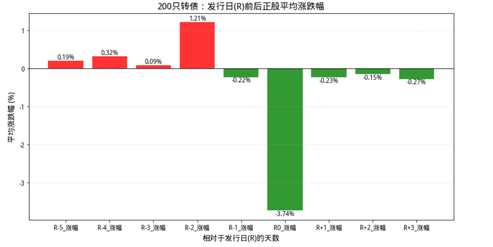

# 第一次实战聚宽


## 策略
可转债有一个很经典的策略叫配售，被戏称为“*亏钱的手艺*”，大概就是配售确权日买股票认购可转债，第二天卖出正股等可转债上市。为什么叫亏钱的手艺呢，因为大部分时间都是亏的。
这时候就有聪明的小伙伴问了，那我在前一天买正股，确权日当天卖给想配售的韭菜呢？
嘿，我就对这个策略做了回测。

## 代码
聚宽的帮助文件写的很详细，所以没遇到什么坑。

**不过有个小BUG，聚宽只有可转债发行日，也就是确权日的第二天，代码里我更关注确权日，所以实际上R是发行日也就是申购日，R-1才是确权日。这个自己知道就行，懒得改了。**
### 分析数据
#### 代码：


```python
import pandas as pd
import numpy as np
from datetime import timedelta
from jqdata import bond

# 1. 获取近三年发行的可转债基础资料
print("正在提取 CONBOND_BASIC_INFO 数据...")

# 修正语法：使用 表名.字段名 进行过滤
q = query(bond.CONBOND_BASIC_INFO).filter(
    bond.CONBOND_BASIC_INFO.list_date >= '2023-01-01',
    bond.CONBOND_BASIC_INFO.bond_type_id == 703013 
)
df_bond = bond.run_query(q)

# 过滤掉日期缺失的坏数据
df_bond = df_bond.dropna(subset=['issue_start_date', 'list_date', 'company_code'])
print("✅ 成功提取 {} 只可转债信息".format(len(df_bond)))

def get_event_matrix(stock_code, event_date, window, prefix):
    if not event_date: return {}
    
    # 获取前后各20天行情
    start = event_date - timedelta(days=20)
    end = event_date + timedelta(days=20)
    
    try:
        # 聚宽 get_price 自动处理复权
        df_h = get_price(stock_code, start_date=start, end_date=end, frequency='daily')
        if df_h is None or df_h.empty: return {}
        
        # 寻找事件日索引
        idx = df_h.index.get_loc(pd.Timestamp(event_date), method='nearest')
        
        res = {}
        for w in window:
            t_idx = idx + w
            if 0 < t_idx < len(df_h):
                curr, prev = df_h.iloc[t_idx], df_h.iloc[t_idx-1]
                tag = "{}{}".format(prefix, w if w<=0 else '+'+str(w))
                # 涨跌幅和振幅
                res["{}_涨幅".format(tag)] = round((curr['close']/prev['close']-1)*100, 2)
                res["{}_振幅".format(tag)] = round((curr['high']-curr['low'])/prev['close']*100, 2)
        return res
    except:
        return {}

# 2. 遍历计算矩阵
results = []
# 跑 200 只作为回测样本
for _, row in df_bond.head(200).iterrows():
    s_code = row['company_code']
    r_day = row['issue_start_date'] 
    t_day = row['list_date']        
    
    item = {"名称": row['short_name'], "代码": row['code'], "正股": s_code}
    item.update(get_event_matrix(s_code, r_day, range(-5, 4), "R"))
    item.update(get_event_matrix(s_code, t_day, range(-3, 3), "T"))
    results.append(item)

df_matrix = pd.DataFrame(results)

# 3. 展示结果与统计
if not df_matrix.empty:
    print("\n--- 矩阵预览（前5行） ---")
    print(df_matrix.head())
    
    # 统计 R+1 日（通常是贴权抛压日）的平均表现
    if 'R+1_涨幅' in df_matrix.columns:
        avg_r_plus_1 = df_matrix['R+1_涨幅'].mean()
        print("\n📊 统计发现：过去三年样本中 R+1 日平均涨幅为 {:.2f}%".format(avg_r_plus_1))
else:
    print("未能生成矩阵，请检查正股行情或日期数据。")
```
#### 输出如下:    
```text
正在提取 CONBOND_BASIC_INFO 数据...
✅ 成功提取 229 只可转债信息

--- 矩阵预览（前5行） ---
   R+1_振幅  R+1_涨幅  R+2_振幅  R+2_涨幅     ...       T0_涨幅      代码    名称           正股
0    1.34    0.19    3.81   -0.13     ...        1.15  127077  华宏转债  002645.XSHE
1    3.09   -3.44    2.22   -0.67     ...        0.11  113664  大元转债  603757.XSHG
2    2.38    1.13    1.79   -0.45     ...        0.60  118028  会通转债  688219.XSHG
3    2.91    1.78    4.61    1.43     ...       -1.17  110091  合力转债  600761.XSHG
4    2.56   -2.56    3.78    0.49     ...        0.83  127078  优彩转债  002998.XSHE

[5 rows x 33 columns]

📊 统计发现：过去三年样本中 R+1 日平均涨幅为 -0.23%
```
这样不直观，所以需要用绘图

### 绘制图片
#### 代码
```python
import matplotlib.pyplot as plt
import pandas as pd

# 1. 确认数据源
try:
    plot_df = df_final
except NameError:
    plot_df = df_matrix
# 2. 动态重新生成 r_cols 并排序
raw_r_cols = [c for c in plot_df.columns if 'R' in c and '涨幅' in c]

# 关键：按数字大小排序 (-5, -4, ... 0, 1...)，否则画出来的图时间轴是乱的
r_cols = sorted(raw_r_cols, key=lambda x: int(x.split('_')[0].replace('R', '')))

print("✅ 成功提取并排序 R 列:", r_cols)

# 3. 计算均值
r_mean = plot_df[r_cols].mean()

# 4. 绘图 (加入中文支持，防止乱码)
plt.figure(figsize=(12, 6))

# 设置中文字体，聚宽环境通常支持 MicroSoft YaHei 或 SimHei
plt.rcParams['font.sans-serif'] = ['SimHei', 'Arial Unicode MS'] 
plt.rcParams['axes.unicode_minus'] = False # 解决负号显示为方块的问题

# 绘制柱状图
colors = ['green' if v < 0 else 'red' for v in r_mean.values] # 跌绿涨红
bars = plt.bar(r_mean.index, r_mean.values, color=colors, alpha=0.8)

# 添加数值标签
for bar in bars:
    height = bar.get_height()
    plt.text(bar.get_x() + bar.get_width()/2., height,
             f'{height:.2f}%',
             ha='center', va='bottom' if height > 0 else 'top', fontsize=10)

plt.axhline(0, color='black', linestyle='-', linewidth=0.8)
plt.title(f"{len(plot_df)}只转债：发行日(R)前后正股平均涨跌幅", fontsize=14)
plt.ylabel("平均涨跌幅 (%)", fontsize=12)
plt.xlabel("相对于发行日(R)的天数", fontsize=12)
plt.grid(axis='y', linestyle='--', alpha=0.3)

plt.show()
```
#### 结果如下:

## 结论
### 不靠谱
该策略不靠谱，200只可转债的统计规律可以显示，平均收益率在*R-1*也就是确权日那一天甚至是<font color="#2ea44f">**-0.22%**</font>，在可转债发行第一天也就是申购日，正股平均涨幅达<font color="#2ea44f">**-3.74%**</font>,在确权日前一天也就是*R-2*卖出会得到平均<font color="#ff0000">**1.21%**</font>的收益，但是这收益太低了，完全不值得。
### 分析原因
这个先潜伏正股，等到确权日卖给抢权配售可转债的韭菜的策略被广泛使用了，导致大家开始抢跑。也就是想配售可转债的韭菜们也不在确权日买了，而是在确权日前一天也就是*R-2*买，这导致了*R-2*日的上涨，当然也有更抢跑的，所以*R-5*,*R-4*,*R-3*的平均收益率都是为正。
而交易双方都知道在申购日当天也就是*R0*配售可转债的投资者会卖掉股票，这天股价必定暴跌，所以那些潜伏正股的投资者极限就是*R-1*日必须卖出，此时有大量配售可转债的投资者已经在前几天购买了正股，当日配售买正股的力量被削弱了，进而导致*R-1*日的微跌。
## 收获
量化我是做不来的，没那个条件和技术，但是一些冷门策略可以靠这种方式进行回测验证，感谢聚宽。


---

> 作者: Mavelsate  
> URL: https://blog.yeliya.site/posts/%E8%81%9A%E5%AE%BD%E7%9A%84%E7%AC%AC%E4%B8%80%E6%AC%A1%E4%BD%BF%E7%94%A8/  

