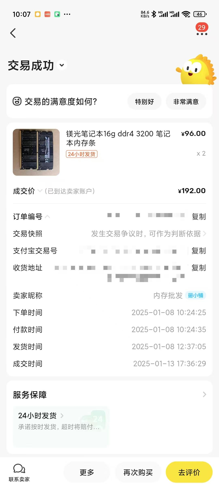
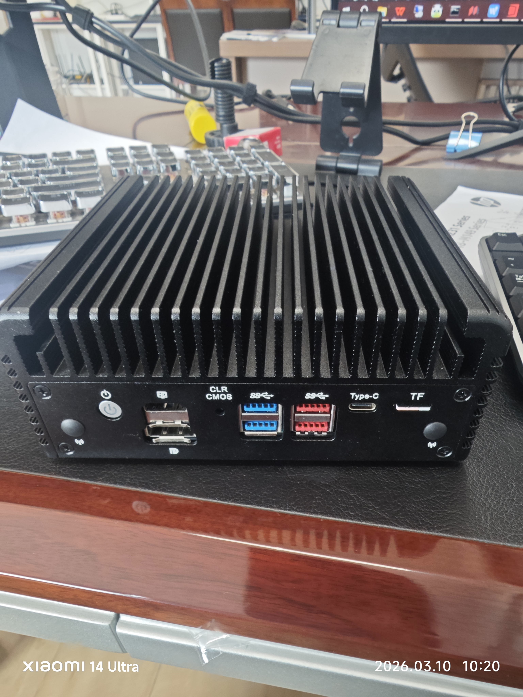
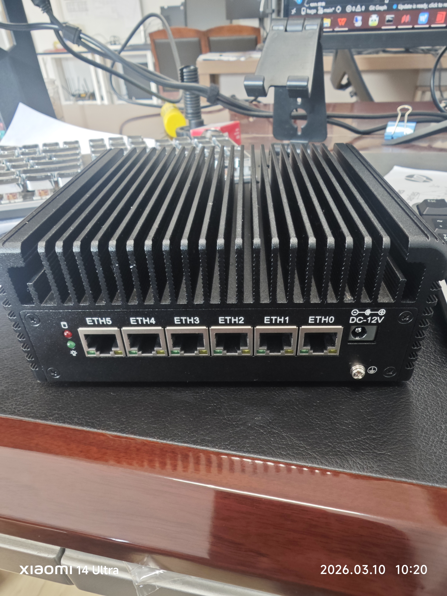
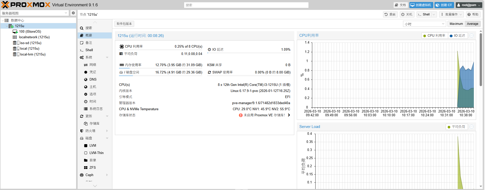
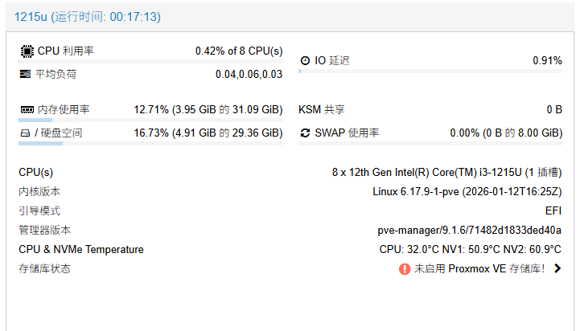

# 软路由，启动！

## 我为什么需要软路由
&nbsp;&nbsp;&nbsp;&nbsp;&nbsp;&nbsp;&nbsp;&nbsp;我之前再翻我的咸鱼记录的时候，意外发现我25年1月居然花了190买了两条16G的笔记本内存条，现在两条加一起的价格基本是1000块钱了，我就陷入了到底是卖内存条还是买个机器把它用起来的焦虑心理。我打算卖掉，我老婆嘲笑我：股票亏成这样了么，都要卖家产了。好吧，老婆大人的嘲笑非常有道理，虽然我亏了很多，但是也还没到卖家产的地步。

&nbsp;&nbsp;&nbsp;&nbsp;&nbsp;&nbsp;&nbsp;&nbsp;我有一个火影A8，8845HS+48G内存，双2.5G网口，理论上这个也是可以做软路由的，但是两个网口还是过于紧张了，一进一出就没有空闲网口了，尤其是后期我打算做双网接入，两个网口是万万不够的，加上飞牛上个月也出了安全漏洞，所以我也不想把飞牛搭建在存放自己量化算法代码的机器上。

&nbsp;&nbsp;&nbsp;&nbsp;&nbsp;&nbsp;&nbsp;&nbsp;综上所述，我打算买个软路由，我现在的所拥有的破烂包括，2条16G内存，1个2.5寸2THDD，一个2.5寸2TSSD，四个nvme固态。其他的大硬盘之类的都在老宅里。

&nbsp;&nbsp;&nbsp;&nbsp;&nbsp;&nbsp;&nbsp;&nbsp;所以我对软路由的要求就是：

- 网口起步就是2.5G，网口不得低于四个；
- 至少要有2个SATA口，两个nvme口（可以接受无线网卡转接）；
- 要便宜，越便宜越好；功耗越低越好；
  
&nbsp;&nbsp;&nbsp;&nbsp;&nbsp;&nbsp;&nbsp;&nbsp;但是咸鱼上等了好久好久，基本上看中的不多，一个破加4125的软路由也能卖到400多，简直是抢钱，N100这种万一也能卖到500多，现在的市场真是扭曲了。后来看到一个AMD5700U的软路由，结果下手慢一步，被人抢了。

&nbsp;&nbsp;&nbsp;&nbsp;&nbsp;&nbsp;&nbsp;&nbsp;我就上头了，正好有个大佬出1215U的软路由，六个网口，双SATA，双内存条，+30给电源。我便690全款拿下.

## 机器到手
&nbsp;&nbsp;&nbsp;&nbsp;&nbsp;&nbsp;&nbsp;&nbsp;机器沉甸甸的，很有分量。六个网口都是i226V的，主板接口也多。除了风扇接口以外，还要小四口的电源口，可以再接俩硬盘。

## 装机测试
&nbsp;&nbsp;&nbsp;&nbsp;&nbsp;&nbsp;&nbsp;&nbsp;话不多说，直接把我所有的配件全是插上去。顺便还插上了一个tf卡当镜像仓库和备份仓库。

&nbsp;&nbsp;&nbsp;&nbsp;&nbsp;&nbsp;&nbsp;&nbsp;然后在BIOS里把虚拟化、来电自启这些东西全开了。

&nbsp;&nbsp;&nbsp;&nbsp;&nbsp;&nbsp;&nbsp;&nbsp;然后就是按部就班的安装PVE，安装istoreOS。

&nbsp;&nbsp;&nbsp;&nbsp;&nbsp;&nbsp;&nbsp;&nbsp;最后按照我的习惯，修改了PVE的JS代码，让它显示CPU温度和硬盘温度。

&nbsp;&nbsp;&nbsp;&nbsp;&nbsp;&nbsp;&nbsp;&nbsp;但是让我意想不到的问题来了，1215U的发热问题，或者是说这个小主机的散热很一般。运行了大概15分钟，硬盘温度就突破60℃了，虽说nvme在75℃以下都很安全，但是还是不爽。我决定使用3D打印机打印一个散热底座。

## 后续工作

&nbsp;&nbsp;&nbsp;&nbsp;&nbsp;&nbsp;&nbsp;&nbsp;其实我之前就想好要打印底座了，但是我的材料都是PLA的，所以我额外购买了PETG的材料，花费10块钱（原价20，有个优惠券减了10块钱），原计划等到机器到了量好尺寸就可以打印了，现在看来，我需要在底座设计图上修改一下，对散热做额外处理。先这样吧，明天再说咯。

---

> 作者: Mavelsate  
> URL: https://blog.yeliya.site/posts/%E8%BD%AF%E8%B7%AF%E7%94%B1%E5%90%AF%E5%8A%A8/  

